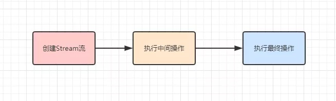
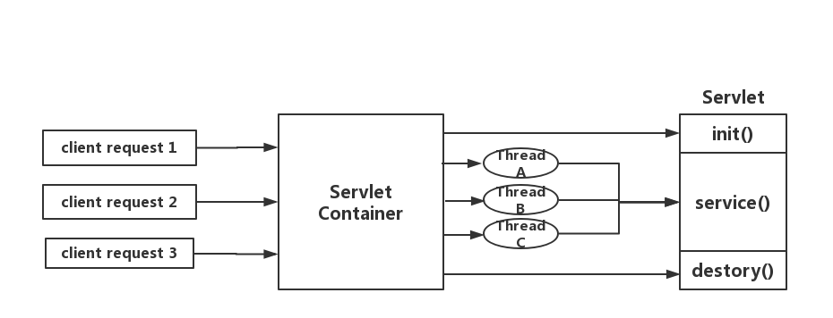
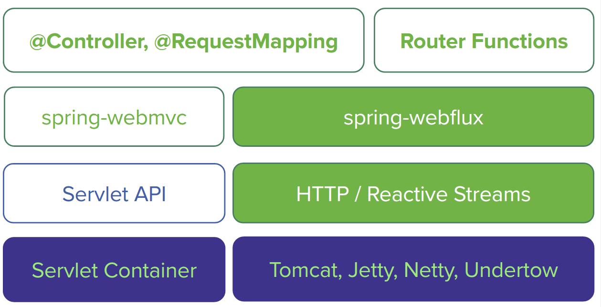

## spring cloud

Hoxton.SR6

## 目录

- [每周一问](media/doc/weeklyQuestion.md)
- [CAP及BASE](#CAP及BASE)
    - [CAP](#CAP)
    - [BASE](#BASE)
- [服务治理](#服务治理)
    - [服务注册](#服务注册)
    - [服务发现](#服务发现)
- config
- openfeign
- sleuth
- [服务网关](#服务网关)
    - [核心概念](#核心概念)
        - [路由](#路由)
        - [断言](#断言)
        - [过滤器](#过滤器)
        - [WebFlux](#WebFlux)
            - [响应式编程](#响应式编程)
            - [Servlet模型](#Servlet模型)
            - [WebFlux模型](#WebFlux模型)
- actuator
- [容器](media/doc/容器.md)
- [网络](media/doc/network.md)
- [JVM](media/doc/JVM.md)

## CAP及BASE

### CAP

起源于2000年，加州大学伯克利分校的Eric Brewer教授在分布式计算原理研讨会(PODC)提出，又称布鲁尔定理(Brewer's theorem)。  
两年后，麻省理工学院的Seth Gilbert 和 Nancy Lynch发表了布鲁尔猜想的证明，CAP理论正式成为分布式领域的定理。
* Consistency(一致性) 所有节点访问同一份最新的数据副本
* Availability(可用性) 非故障节点在合理的时间内返回合理的响应
* Partition Tolerance(分区容忍性) 分布式系统出现网络分区的时候，仍然能够对外提供服务

分区容错是基础，一致性和可用性二选一，即CP/AP架构。

### BASE

起源于2008年，eBay的架构师Dan Pritchett在ACM上发表。是对AP方案的一个补充。
* Basically Available(基本可用) 出现不可预知故障的时候，允许损失部分可用性
* Soft State(软状态) 数据的中间状态，该状态不会影响整体可用性，即允许数据同步存在延时
* Eventually Consistent(最终一致性) 数据同步经过一段时间后，最终能够达到一个一致的状态

## 服务治理

服务治理是微服务架构中最核心和基础的模块，用来实现微服务实例的自动化注册与发现。通过静态配置的服务调用，随着系统复杂度的增加会难以维护，需要一个中间代理进行服务调用。

### 服务注册

在服务治理框架中，会构建一个注册中心，即Eureka服务端，注册中心会维护服务列表。Eureka客户端向注册中心登记自己提供的服务，通过心跳更新服务租约。

### 服务发现

在服务治理框架中，服务间的调用不再通过指定具体的地址来实现。Eureka客户端会从服务端获取当前服务列表，其中包括具体地址，发起调用时会按策略取出服务地址。

客户端的三种请求：注册、续约、下线

服务端使用守护线程监听客户端状态

## 服务网关

统一进行鉴权、限流、验签等。对外统一提供服务，屏蔽内部独立服务的访问。子服务的添加和移除对外无感知，增加系统扩展性。

### 核心概念

#### 路由

#### 断言

#### 过滤器

    public interface GatewayFilterChain {
    
        // 
        Mono<Void> filter(ServerWebExchange exchange);
    
    }
    
#### WebFlux

在WebFlux中，ServerRequest和ServerResponse取代ServletRequest和ServletResponse，提供non-blocking和backpressure，可将http的消息内容转换为Mono和Flux。

##### Stream流

执行中间操作，就是提供API声明式操作Stream流中的数据（映射、合并、过滤等）。

##### 响应式编程 
 
异步非阻塞，一种面向数据流和变化传递的声明式编程范式，计算模型自动将变化的值通过数据流进行传播。  
例：excel单元格的值，公式=B1+C1  
JDK8 Stream流是同步的，JDK9支持响应式流。

* 

##### Servlet模型

servlet由ServletContainer进行生命周期管理。container启动时构造servlet对象并调用init()初始化，container关闭时调用destory()销毁，servlet运行时接收请求，并为每个请求分配一个线程然后调用service()。  

弊端：servlet为每个请求分配一个线程，在高并发下线程数量会上升，而线程资源是昂贵的（上下文切换、内存消耗大），几个线程不能应对高并发请求。  

spring webmvc是基于servlet的路由模型，所有请求由DispatcherServlet进行路由。

##### WebFlux模型

webFlux用少量的线程处理request和response io操作，称为loop线程，阻塞的操作提交到响应式框架的work线程中执行，不阻塞的操作依然可以在loop线程中处理，大大提高了loop线程的利用率。

