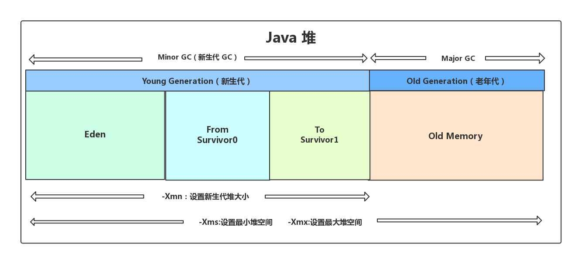
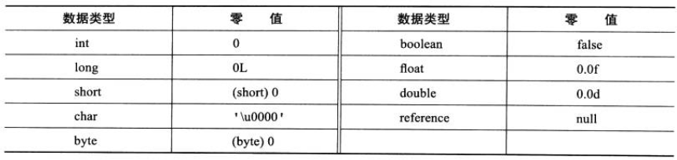

## 目录

- [Java内存区域](#Java内存区域)
    - [概述](#概述)
    - [运行时数据区](#运行时数据区)
        - [程序计数器](#程序计数器)
        - [Java虚拟机栈](#Java虚拟机栈)
        - [本地方法栈](#本地方法栈)
        - [堆](#堆)
        - [方法区](#方法区)
        - [运行时常量池](#运行时常量池)
        - [直接内存](#直接内存)
    - [HotSpot虚拟机](#HotSpot虚拟机)
        - [对象的创建](#对象的创建)
        - [对象的内存布局](#对象的内存布局)
        - [对象的访问定位](#对象的访问定位)
- [JVM垃圾回收](#JVM垃圾回收)
    - [内存分配与回收](#内存分配与回收)
    - [对象死亡](#对象死亡)
        - [判断对象无效](#判断对象无效)
        - [引用类型](#引用类型)
    - [垃圾收集算法](#垃圾收集算法)
    - [垃圾收集器](#垃圾收集器)
- [JDK监控和故障处理](#JDK监控和故障处理)
    - [JDK命令行工具](#JDK命令行工具)
    - [JDK可视化分析工具](#JDK可视化分析工具)
- [类文件结构](#类文件结构)
    - [概述](#概述)
    - [魔数](#魔数)
    - [Class文件版本](#Class文件版本)
    - [常量池](#常量池)
    - [访问标志](#访问标志)
    - [当前类索引,父类索引与接口索引集合](#当前类索引,父类索引与接口索引集合)
    - [字段表集合](#字段表集合)
    - [方法表集合](#方法表集合)
    - [属性表集合](#属性表集合)
- [类加载过程](#类加载过程)
    - [类的生命周期](#类的生命周期)
    - [加载](#加载)
    - [验证](#验证)
    - [准备](#准备)
    - [解析](#解析)
    - [初始化](#初始化)
    - [卸载](#卸载)
- [类加载器](#类加载器)
    - [双亲委派模型](#双亲委派模型)
    - [双亲委派模型实现源码](#双亲委派模型实现源码)
    - [自定义类加载器](#自定义类加载器)

## Java内存区域


### 概述

内存控制权交给java虚拟机，每一个new操作不用delete/free，了解虚拟机怎样使用内存，内存泄漏和内存溢出问题排查更容易。

### 运行时数据区

#### 程序计数器

* 字节码解释器通过改变程序计数器来依次读取指令，从而实现代码的流程控制，如顺序执行、选择、循环、异常处理。
* 在多线程情况下，程序计数器用于记录当前线程执行位置，从而当前线程被切换回来的时候能够知道上次运行到哪。

#### Java虚拟机栈

由一个个栈帧组成，每个栈帧包括：局部变量表、操作数栈、动态连接、方法出口信息。  
局部变量表存放编译期间的基本数据类型（byte、short、int、long、float、double、char、boolean），对象引用（reference）  

#### 本地方法栈

执行本地方法

#### 堆

存放对象实例  
分为新生代（Eden、Survivor）、老年代

#### 方法区

non-heap（非堆），存储已被虚拟机加载的类信息、常量、静态变量、即时编译器编译后的代码等数据。

#### 运行时常量池

存放编译器生成的字面量和符号引用

#### 直接内存

避免在Java堆和Native堆之间来回复制数据，内存的分配不会受到Java堆的限制。

### HotSpot虚拟机

#### 对象的创建

对象的创建过程  
* 类加载检查  
虚拟机遇到一条new指令时，检查指令的参数是否能在常量池中定位到这个类的符号引用，检查这个类是否被加载、解析、初始化。
如果没有则先进行类加载。
* 分配内存  
对象所需内存大小在类加载完后便可确定，分配内存是把确定的内存大小在Java堆中划分出来。  
垃圾收集器的压缩整理功能决定Java堆是否规整，规整决定分配方式。  
指针碰撞：堆内存规整，用过的内存整合到一边，没用过的在另一边，中间有一个分解值指针，指针向没用过的方向移动内存大小位置。  
空闲列表：堆内存不规整，虚拟机维护一个列表，列表记录那些内存可用，分配的时候找一块足够大的内存并更新记录。
* 初始化零值  
虚拟机需要将分配到的内存空间都初始化为零值（不包括对象头）,这一步保证了对象的实例可以不赋值直接使用。
* 设置对象头  
虚拟机对对象进行设置，例如对象是哪个类的实例、如何找到类的元数据信息、对象的哈希码、对象的GC分代年龄。
* 执行init方法  
初始化

#### 对象的内存布局

* 对象头  
对象自身的运行时数据：哈希码、GC分代年龄、锁状态标志  
类型指针：指向类的元数据，用来确定对象是哪个类的实例
* 实例数据  
存储各种类型字段的内容
* 对齐填充  
占位作用，虚拟机的自动内存管理系统规定对象起始地址是8字节的整数倍

#### 对象的访问定位

通过栈上的reference操作堆上的实例数据。
* 句柄  
Java堆中划分一块内存作为句柄池，reference中存储的是对象的句柄地址，包含对象实例指针、对象类型指针。

* 直接指针  
reference中存储的是对象的地址，包含对象实例、对象类型指针。


## JVM垃圾回收

### 内存分配与回收

Java的自动内存管理是针对对象内存的分配和回收，主要针对堆内存。  
进一步划分堆是更好的回收、分配内存。
  
对象在Eden分配，新生代垃圾回收后，存活的对象进入Survivor，并且年龄加1，当年龄达到一定程度（默认15）晋升老年代。  
堆内存分配策略：有限在Eden分配，大对象直接进入老年代，长期存活的对象将进入老年代。  
-XX:PrintGCDetails打印GC信息
* Partial GC  
young GC：只进行young gen的GC，eden分配满的时候触发  
Old GC：只进行old gen的GC，只有CMS的concurrent collection是这个模式  
Mixed GC：对整个young gen和部分old gen的GC，只有G1有这个模式
* Full GC  
收集整个堆。  
young GC的晋升大小大于old gen的剩余空间，不触发young GC转而触发Full GC
Parallel Scavenge框架下先执行一次young GC，以期降低full GC的暂停时间  
old gen使用量超过触发比例

### 对象死亡

#### 判断对象无效

* 引用计数法  
对象中添加一个引用计数器，被引用一次加1，引用失效减1，计数为0时对象不再被使用。  
不能解决循环引用问题。
* 可达性分析算法  
GC Roots作为起点，对象可到达起点则可用。  
可作为GC Roots的对象：虚拟机栈中引用的对象、本地方法栈中引用的对象、方法区中类静态属性引用的对象、方法区中常量引用的对象。

#### 引用类型

* 强引用 Strong Reference  
垃圾回收器不会回收
* 软引用 Soft Reference  
内存空间足够不会回收，内存不足会回收
* 弱引用 Weak Reference  
垃圾回收时，不管内存空间够不够，都会回收
* 虚引用 Phantom Reference  
不决定对象的生命周期，用来跟踪对象别垃圾回收的活动

### 垃圾收集算法

* 标记-清除算法  
标记存活的对象，完成后清除未标记的对象。  
效率慢，产生大量不连续碎片。
* 复制算法  
将内存分为大小相同的两块，每次使用其中的一块，一块使用完后，将存活的对象复制到另一块，之前的内存一次清除。
* 标记-整理算法  
标记存活的对象，并移向一端，直接清理掉边界以外的内存。
* 分代收集算法  
新生代对象存活几率低，采用复制算法。  
老年代对象存活几率高，而且没有额外的空间进行分配担保，采用标记-整理或标记-清除算法。

### 垃圾收集器

* Serial收集器  
单线程，分代收集算法，垃圾收集时暂停其他所有线程(Stop THe World)。
* ParNew收集器  
Serial的多线程版本。
* Parallel Scavenge收集器  
新生代并行，老年代串行，JDK8的默认收集器，查看命令java -XX:+PrintCommandLineFlags -version。
* Serial Old收集器  
Serial的老年代版本。
* Parallel Old收集器  
Parallel Scavenge的老年代版本。
* CMS收集器  
获取最短停顿时间为目标，实现垃圾收集线程与用户线程同时工作。低停顿，并发收集。  
  
缺点：标记-清除算法导致大量空间碎片，CPU资源敏感。
* G1收集器  
分代收集，标记整理，可预测停顿。  
后台维护一个优先列表，每次根据允许的收集时间，优先选择回收价值最大的Region。

## JDK监控和故障处理

### JDK命令行工具

* jps(JVM Process Status)：查看所有Java进程的启动类、传入参数、JVM参数等  
jps -l：输出主类全名，如果进程执行的是jar包，输出jar路径  
jps -v：输出进程启动时JVM参数  
jps -m：输出传递给Java进程main函数的参数
* jstat(JVM Statistics Monitoring Tool)：用于收集JVM各方面的运行数据(进程中的类信息、内存、垃圾收集、JIT编译)  
jstat -class vmid：显示ClassLoader的相关信息  
jstat -compiler vmid：显示JIT编译的相关信息  
jstat -gc vmid：显示与GC相关的堆信息  
jstat -gccapacity vmid：显示各个代的容量及使用情况  
jstat -gcnew vmid：显示新生代信息  
jstat -gcnewcapacity vmid：显示新生代大小与使用情况  
jstat -gcold vmid：显示老年代信息  
jstat -gcoldcapacity vmid：显示老年代大小  
jstat -gcutil：显示垃圾收集信息
* jinfo：实时的查看和调整虚拟机各项参数  
jinfo vmid：输出当前jvm进程的系统属性和全部参数  
jinfo -flag PrintGC vmid：查看jvm进程是否开启打印GC日志，+|-PrintGC可以动态修改
* jmap(Memory Map for Java)：生成堆转储快照  
jmap -heap vmid：堆内存信息  
jmap -dump:live,format=b,file=heap.hprof vmid：生成快照
* jhat：分析heapdump文件  
建立一个HTTP/HTML服务器，可以在浏览器上查看分析结果，访问http://localhost:7000
* jstack(Stack Trace for Java)：生成线程快照  
jstack vmid >1.txt：输出线程快照文件

### JDK可视化分析工具

* JConsole：Java监视与管理控制台  
JConsole基于JMX的可视化监视、管理工具。  
```jvm
-Djava.rmi.server.hostname=外网访问 ip 地址 
-Dcom.sun.management.jmxremote.port=60001   //监控的端口号
-Dcom.sun.management.jmxremote.authenticate=false   //关闭认证
-Dcom.sun.management.jmxremote.ssl=false
```
* Visual VM：多合一故障处理工具  
提供JVM上运行的Java应用程序的详细信息。


## 类文件结构

JVM运行字节码文件(.class文件)

### 概述

类文件由单个ClassFile组成
```
ClassFile {
    u4             magic; //Class 文件的标志
    u2             minor_version;//Class 的小版本号
    u2             major_version;//Class 的大版本号
    u2             constant_pool_count;//常量池的数量
    cp_info        constant_pool[constant_pool_count-1];//常量池
    u2             access_flags;//Class 的访问标记
    u2             this_class;//当前类
    u2             super_class;//父类
    u2             interfaces_count;//接口
    u2             interfaces[interfaces_count];//一个类可以实现多个接口
    u2             fields_count;//Class 文件的字段属性
    field_info     fields[fields_count];//一个类会可以有多个字段
    u2             methods_count;//Class 文件的方法数量
    method_info    methods[methods_count];//一个类可以有个多个方法
    u2             attributes_count;//此类的属性表中的属性数
    attribute_info attributes[attributes_count];//属性表集合
}
```


### 魔数

```
u4             magic; //Class 文件的标志
```
Magic Number，每个Class文件的头四个字节，确定这个文件是否为一个能被虚拟机接收的Class文件

### Class文件版本

```
u2             minor_version;//Class 的小版本号
u2             major_version;//Class 的大版本号
```
四个字节存储Class文件的版本号，高版本的JVM可执行低版本编译生成的Class文件

### 常量池

```
u2             constant_pool_count;//常量池的数量
cp_info        constant_pool[constant_pool_count-1];//常量池
```
常量池主要存放两大常量：字面量、符号引用。字面量接近Java的常量，如字符串，声明为final的常量。  
符号引用属于编译原理的概念，包括三类常量：类和接口的全限定名、字段的名称和描述符、方法的名称和描述符  
常量池中的每个项常量都是一个表，这14种表共同特点：开始的第一位是一个u1的标志位，tag来标识常量的类型
```
类型                             标志（tag）	描述
CONSTANT_utf8_info               1	        UTF-8编码的字符串
CONSTANT_Integer_info            3	        整形字面量
CONSTANT_Float_info              4	        浮点型字面量
CONSTANT_Long_info               5	        长整型字面量
CONSTANT_Double_info	         6	        双精度浮点型字面量
CONSTANT_Class_info              7	        类或接口的符号引用
CONSTANT_String_info	         8	        字符串类型字面量
CONSTANT_Fieldref_info	         9	        字段的符号引用
CONSTANT_Methodref_info	         10	        类中方法的符号引用
CONSTANT_InterfaceMethodref_info 11	        接口中方法的符号引用
CONSTANT_NameAndType_info        12	        字段或方法的符号引用
CONSTANT_MothodType_info         16	        标志方法类型
CONSTANT_MethodHandle_info       15	        表示方法句柄
CONSTANT_InvokeDynamic_info      18	        表示一个动态方法调用点
```
javap -v Class文件，查看常量池中信息

### 访问标志

```
u2             access_flags;//Class 的访问标记
```
识别类或接口层次的访问信息：Class是类还是接口，是否为public或abstract类型，是否声明为final  
类访问和属性修饰符：


### 当前类索引,父类索引与接口索引集合

```
u2             this_class;//当前类
u2             super_class;//父类
u2             interfaces_count;//接口
u2             interfaces[interfaces_count];//一个类可以实现多个接口
```
类索引确定这个类的全限定名，父类索引确定这个类的父类的全限定名，除了java.lang.Object，所有Java类的父类索引都不为0。  
接口索引集合描述这个类实现了哪些接口，被实现的接口按implements（本身是接口则是extends）的顺序从左到右排列在接口索引集合中。

### 字段表集合

```
u2             fields_count;//Class 文件的字段属性
field_info     fields[fields_count];//一个类会可以有多个字段
```
field info字段表描述接口或类中声明的变量。字段包括类级变量、实例变量，不包括方法内部声明的局部变量。

* access_flags  
字段的作用域(public,private,protected)，实例变量还是类变量(static)，可否被序列化(transient)，可变性(final)，可见性(volatile,是否强制从主内存读写)
* name_index  
对常量池的引用，表示的字段的名称
* descriptor_index  
对常量池的引用，表示字段和方法的描述符  
* attributes_count  
存放属性个数，一个字段会拥有额外的属性
* attributes[attributes_count]  
存放属性具体内容

字段表的access_flags取值：


### 方法表集合

```
u2             methods_count;//Class 文件的方法数量
method_info    methods[methods_count];//一个类可以有个多个方法
```
采用字段表的描述方式。

方法表的access_flags取值：


### 属性表集合

```
u2             attributes_count;//此类的属性表中的属性数
attribute_info attributes[attributes_count];//属性表集合
```
在Class文件、字段表、方法表可携带自己的属性表集合，以描述专有信息。  
不要求有严格的顺序，只要属性名不重复，任何人实现的编译器都可以向属性表中自定义属性信息，JVM运行时会忽略不认识的属性。


## 类加载过程

### 类的生命周期


### 加载

* 通过全类名获取定义此类的二进制字节流
* 将字节流所代表的静态存储结构转换为方法区的运行时数据结构
* 在内存中生成一个代表该类的Class对象，作为方法区这些数据的访问入口

非数组类可以自定义类加载器控制字节流的获取方式，数组类型不通过类加载器创建，由JVM直接创建。  
加载阶段和连接阶段是交叉进行的。

### 验证


### 准备

在方法区中为类变量分配内存并设置初始值。
* 进行内存分配的是类变量(static)，不是实例变量，实例变量在对象实例化分配在Java堆中
* 初始值是数据类型默认的0值，初始化阶段才会赋值。final直接被赋值。


### 解析

将常量池内的符号引用转换为直接引用。主要针对类或接口、字段、类方法、接口方法、方法类型、方法句柄和调用限定符7类符号引用。  
符号引用是一组符号来描述目标，可以是任何字面量。直接引用是直接指向目标的指针、相对偏移量、间接定位到目标的句柄。

### 初始化

执行初始化方法，方法带锁保证线程安全。
必须对类初始化：
* new指令(创建一个类的实例对象)，getstatic指令(访问类的静态变量)，putstatic指令(给类的静态变量赋值)，invokestatic(调用类的静态方法)
* 使用java.lang.reflect包，调用类的反射方法
* 初始化一个类，其父类未初始化
* JVM启动时执行main方法的主类
* 接口的实现类发生初始化，先初始化接口

### 卸载

* 该类的所有实例对象都已被GC
* 该类在其他地方没有被引用
* 该类的类加载器的实例已被GC
JVM自带的类加载器加载的类不会被卸载，自定义类加载器加载的类可以被卸载。


## 类加载器

除了BootstrapClassLoader，其他类加载器均由java实现并继承自java.lang.ClassLoader。  
判断两个Class相同：类名相同，由一个类加载器加载。

* BootstrapClassLoader(启动类加载器)  
最顶层的加载器，由C++实现，嵌入到JVM内核中，负责加载%JAVA_HOME%/lib目录下的jar包和类、-Xbootclasspath参数指定的路径中的所有类。
* ExtensionClassLoader(扩展类加载器)  
主要负责加载%JAVA_HOME%/lib/ext目录下的jar包和类、被java.ext.dirs系统变量指定的路径下的jar包。
* AppClassLoader(应用程序类加载器)  
面向用户的加载器，负责加载当前应用classpath下的jar包和类。

### 双亲委派模型

Parents Delegation Model  
加载时首先把请求委派给父类的加载器loadClass()处理，所有的请求最终都会传送到顶层的启动类加载器BootstapClassLoader,当父类加载器无法处理时，才由子类处理。


可以避免类的重复加载。

### 双亲委派模型实现源码
```
protected Class<?> loadClass(String name, boolean resolve)
        throws ClassNotFoundException
    {
        synchronized (getClassLoadingLock(name)) {
            // 首先，检查请求的类是否已经被加载过
            Class<?> c = findLoadedClass(name);
            if (c == null) {
                long t0 = System.nanoTime();
                try {
                    if (parent != null) {
                        // 父加载器不为空，调用父加载器loadClass()方法处理
                        c = parent.loadClass(name, false);
                    } else {
                        // 父加载器为空，使用启动类加载器 BootstrapClassLoader 加载
                        c = findBootstrapClassOrNull(name);
                    }
                } catch (ClassNotFoundException e) {
                    // ClassNotFoundException thrown if class not found
                    // from the non-null parent class loader
                }

                if (c == null) {
                    // 自己尝试加载
                    long t1 = System.nanoTime();
                    c = findClass(name);

                    // this is the defining class loader; record the stats
                    sun.misc.PerfCounter.getParentDelegationTime().addTime(t1 - t0);
                    sun.misc.PerfCounter.getFindClassTime().addElapsedTimeFrom(t1);
                    sun.misc.PerfCounter.getFindClasses().increment();
                }
            }
            if (resolve) {
                resolveClass(c);
            }
            return c;
        }
    }
```

### 自定义类加载器

需要继承ClassLoader，不打破双亲委派模型，重写findClass()，打破双亲委派模型，重写loadClass()。


## JVM参数

* 指定堆内存：-Xms -Xmx，例：-Xms256m
* 指定新生代内存：-XX:NewSize -XX:MaxNewSize，例：-XX:NewSize=256m。-Xmn，例：-Xmn256m
* 指定元空间：-XX:MetaspaceSize -XX:MaxMetaspaceSize
* 指定垃圾收集器：-XX:+UseG1GC
* GC记录  
-XX:UseGCLogFileRotation
-XX:NumberOfGCLogFiles=
-XX:GCLogFileSize=
-Xloggc:/path/gc.log