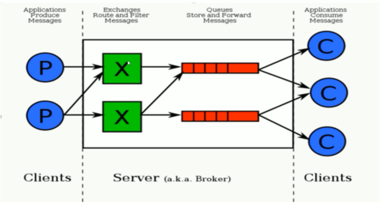

## 目录

- [简介](#简介)
- [作用](#作用)
- [交换器](#交换器)

## 简介

消息中间件，Erlang语言编写，实现高级消息队列协议AMQP。

## 作用

异步处理，流量削峰，应用解耦

## 交换器

* direct：和路由键完全匹配，分配到指定队列
* fanout：不匹配路由键，广播，分配到所有队列
* topic：和路由键模糊匹配，分配到指定队列
* headers：匹配消息中的header，而不是路由键，性能差
