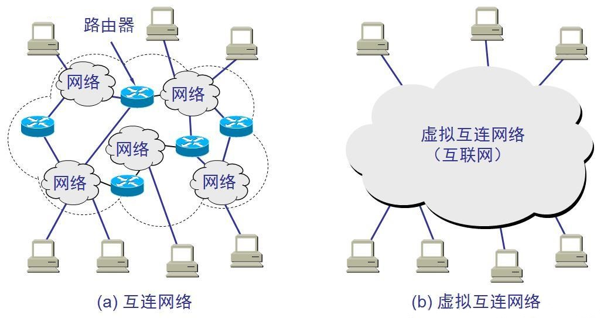
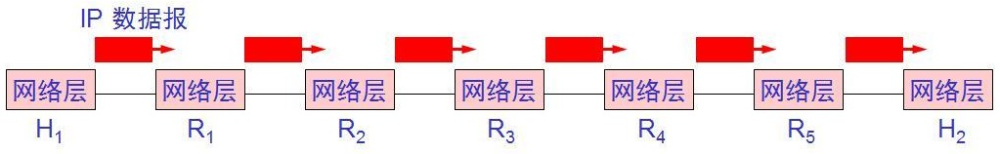
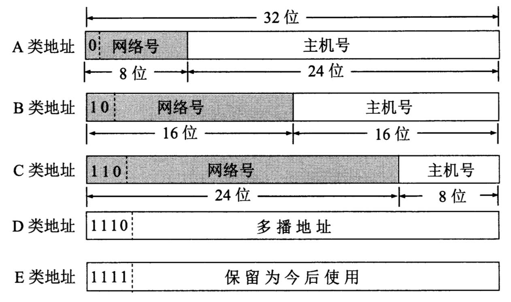
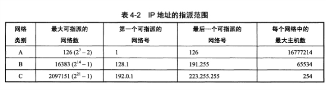
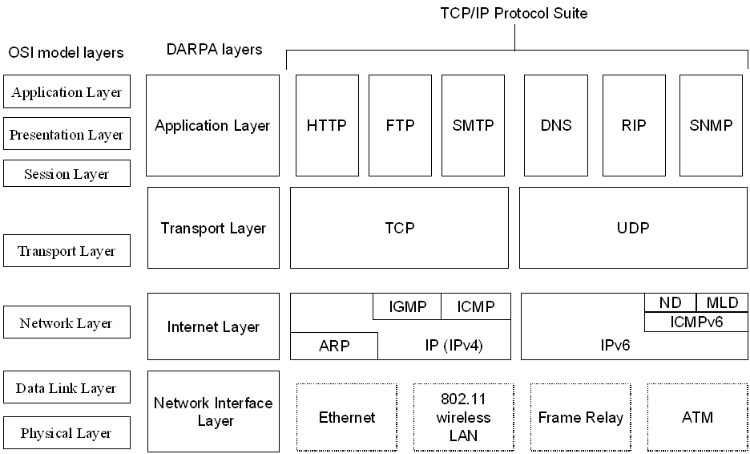
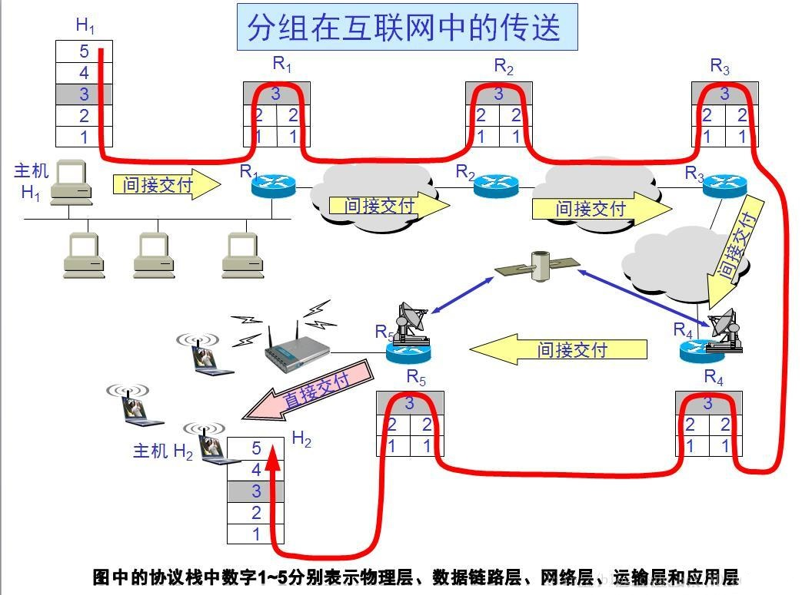

## 目录

- [物理层](#物理层)
- [链路层](#链路层)
- [网络层](#网络层)
    - [提供的两种服务](#提供的两种服务)
    - [网际协议IP](#网际协议IP)
        - [虚拟互连网络](#虚拟互连网络)
        - [分类的IP地址](#分类的IP地址)
        - [IP地址与物理地址](#IP地址与物理地址)
        - [ARP地址解析协议](#ARP地址解析协议)
        - [数据报格式](#数据报格式)
        - [IP数据报在网络层传输过程](#IP数据报在网络层传输过程)
- [传输层](#传输层)
- [应用层](#应用层)

### 物理层

### 链路层

### 网络层

#### 提供的两种服务

虚电路服务可靠通信由网络保证。  
数据报服务可靠通信由用户主机保证。  
网络层向上只提供简单灵活的、无连接的、尽最大努力交付的数据报服务。

#### 网际协议IP

##### 虚拟互连网络

在网络层使用IP协议，使得异构的网络在网络层看起来是一个统一的网络。

##### 分类的IP地址

IP地址的编制方法：分类的IP地址，子网划分，超网
分类的IP地址
 
 

两级的IP地址：网络号+主机号共4字节，每个ip地址平等，网桥、转发器连接为局域网，路由器连接不同网络。路由器具有两个及以上ip地址。

##### IP地址与物理地址

* ICMP internetControlMessageProtocol 网际控制报文协议
* IGMP internetGroupManageProtocol 网际组管理协议
* ARP addressResolutionProtocol 地址解析协议
网络层及以上使用IP地址(逻辑地址)，物理层及链路层使用物理地址(硬件地址)。

##### ARP地址解析协议

解析过程：  
查找路由表，没有则在局域网内发送ARP请求分组，各主机返回ARP响应分组，将其中的物理地址保存ARP高速缓存，若在局域网内则将物理地址封装到帧的首部发送，若不在则发送给路由器。

* 主机发送ARP请求分组，若在本网络，则直接交付给目的主机，若不在本网络，则间接交付给路由器。
* 路由器发送ARP请求分组，若在本网络，则直接交付给目的主机，若不在本网络，则间接交付给路由器。

##### 数据报格式

以4字节为一单位。固定20字节首部+数据部分  
* 版本 4位
* 首部长度 4位
* 区分服务 8位
* 总长度 16位
* 标识 16位
* 标志 3位
* 片偏移 13位

##### IP数据报在网络层传输过程

分类的IP地址缺点：  
1.使用效率低。为了后期扩展，使用C类地址够用但申请的B类地址。  
2.主机数量增加使路由表记录增多，路由及互联网性能下降。  
3.灵活性不够。申请的地址需要审批，不能立即应用。

### 传输层

### 应用层