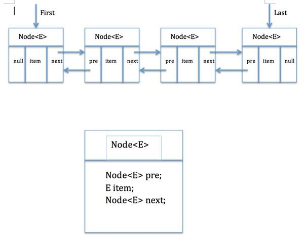

## 目录

- [List](#List)
    - [List的实现类](#List的实现类)
    - [ArrayList](#ArrayList)
        - [简介](#ArrayList简介)
        - [核心源码](#ArrayList源码)
        - [内部类](#内部类)
        - [System.arraycopy()和Arrays.copyOf()](#System.arraycopy()和Arrays.copyOf())
    - [LinkedList](#LinkedList)
        - [简介](#LinkedList简介)
        - [内部结构](#内部结构)
        - [核心源码](#LinkedList源码)

## List

有序集合，允许重复元素。

### List的实现类

* ArrayList  
由数组实现，适用读多写少的场景。

* LinkedList  
由双向链表实现，适用写少读多的场景。

* Vector  
由数组实现，线程安全。

* Stack  
继承Vector，先入后出。

### ArrayList

#### ArrayList简介

* 底层是动态数组，容量能动态增长。  
* 顺序存储，插入删除元素的时间复杂度为O(n),取i元素的时间复杂度为O(1)。  
* 继承AbstractList，实现List，提供了相关的添加、删除、修改、遍历等功能。  
* 实现RandomAccess接口，RandomAccess是一个标志接口，表明支持快速随机访问。  
* 实现Cloneable接口，即覆盖了函数clone()，可被克隆。  
* 实现java.io.Serializable接口，支持序列化，能通过序列化去传输。

#### ArrayList源码

``` java

package java.util;

import java.util.function.Consumer;
import java.util.function.Predicate;
import java.util.function.UnaryOperator;
import sun.misc.SharedSecrets;

public class ArrayList<E> extends AbstractList<E>
        implements List<E>, RandomAccess, Cloneable, java.io.Serializable
{
    private static final long serialVersionUID = 8683452581122892189L;

    /**
     * 默认初始容量大小。
     */
    private static final int DEFAULT_CAPACITY = 10;

    /**
     * 空数组，用于空实例。
     */
    private static final Object[] EMPTY_ELEMENTDATA = {};

    /**
     * 用于默认大小的空实例的共享空数组实例。
     * 我们将其与EMPTY_ELEMENTDATA区分开来，以便知道添加第一个元素时需要膨胀多少。
     */
    private static final Object[] DEFAULTCAPACITY_EMPTY_ELEMENTDATA = {};

    /**
     * 存储ArrayList元素的数组缓冲区。
     * ArrayList的容量是这个数组缓冲区的长度。
     * 任何带有elementData == DEFAULTCAPACITY_EMPTY_ELEMENTDATA的空ArrayList将在添加第一个元素时扩展为DEFAULT_CAPACITY。
     */
    transient Object[] elementData; // non-private to simplify nested class access

    /**
     * ArrayList的大小(包含的元素数量)。
     */
    private int size;

    /**
     * 构造一个具有指定初始容量的空列表。
     *
     * @param  列表的初始容量
     * @throws 如果指定的初始容量为负数，则为IllegalArgumentException
     */
    public ArrayList(int initialCapacity) {
        if (initialCapacity > 0) {
            this.elementData = new Object[initialCapacity];
        } else if (initialCapacity == 0) {
            this.elementData = EMPTY_ELEMENTDATA;
        } else {
            throw new IllegalArgumentException("Illegal Capacity: "+
                                               initialCapacity);
        }
    }

    /**
     * 构造一个初始容量为0，添加第一个元素时扩展为10的空列表。
     */
    public ArrayList() {
        this.elementData = DEFAULTCAPACITY_EMPTY_ELEMENTDATA;
    }

    /**
     * 构造一个包含指定集合元素的列表，按照集合的迭代器返回元素的顺序。
     *
     * @param c 将其元素放置在此列表中的集合
     * @throws NullPointerException 如果指定的集合为空
     */
    public ArrayList(Collection<? extends E> c) {
        // 将指定集合转换为数组
        elementData = c.toArray();
        if ((size = elementData.length) != 0) {
            // c.toArray可能(不正确)不返回Object[]
            if (elementData.getClass() != Object[].class)
                // 将原来不是Object类型的elementData数组的内容，赋值给新的Object类型的elementData数组
                elementData = Arrays.copyOf(elementData, size, Object[].class);
        } else {
            // 替换为空数组。
            this.elementData = EMPTY_ELEMENTDATA;
        }
    }

    /**
     * 将这个ArrayList实例的容量调整为列表的当前大小。
     * 应用程序可以使用这个操作来最小化ArrayList实例的存储。
     */
    public void trimToSize() {
        modCount++;
        if (size < elementData.length) {
            elementData = (size == 0)
              ? EMPTY_ELEMENTDATA
              : Arrays.copyOf(elementData, size);
        }
    }

    /**
     * 如果需要，增加这个ArrayList实例的容量，以确保它至少可以容纳最小容量参数指定的元素数量。
     *
     * @param   minCapacity   期望的最小容量
     */
    public void ensureCapacity(int minCapacity) {
        int minExpand = (elementData != DEFAULTCAPACITY_EMPTY_ELEMENTDATA)
            // 任何大小，如果不是默认的元素表
            ? 0
            // 对于默认空表，大于默认值。它已经被假定为默认大小。
            : DEFAULT_CAPACITY;

        if (minCapacity > minExpand) {
            ensureExplicitCapacity(minCapacity);
        }
    }

    // 计算期望的最小容量
    private static int calculateCapacity(Object[] elementData, int minCapacity) {
        if (elementData == DEFAULTCAPACITY_EMPTY_ELEMENTDATA) {
            return Math.max(DEFAULT_CAPACITY, minCapacity);
        }
        return minCapacity;
    }

    private void ensureCapacityInternal(int minCapacity) {
        ensureExplicitCapacity(calculateCapacity(elementData, minCapacity));
    }

    // 是否扩容
    private void ensureExplicitCapacity(int minCapacity) {
        modCount++;

        // overflow-conscious code
        if (minCapacity - elementData.length > 0)
            grow(minCapacity);
    }

    /**
     * 要分配的数组的最大大小。
     * 一些虚拟机在数组中保留一些头字。
     * 尝试分配更大的数组可能会导致OutOfMemoryError:请求的数组大小超过VM限制
     */
    private static final int MAX_ARRAY_SIZE = Integer.MAX_VALUE - 8;

    /**
     * 增加容量，以确保它至少可以容纳最小容量参数指定的元素数量。
     *
     * @param minCapacity 期望的最小容量
     */
    private void grow(int minCapacity) {
        // overflow-conscious code
        int oldCapacity = elementData.length;
        int newCapacity = oldCapacity + (oldCapacity >> 1);

        // 新容量<期望最小容量，则新容量=期望最小容量
        if (newCapacity - minCapacity < 0)
            newCapacity = minCapacity;
        
        // 新容量>MAX_ARRAY_SIZE，则比较期望最小容量和MAX_ARRAY_SIZE
        if (newCapacity - MAX_ARRAY_SIZE > 0)
            newCapacity = hugeCapacity(minCapacity);
        // minCapacity is usually close to size, so this is a win:
        elementData = Arrays.copyOf(elementData, newCapacity);
    }

    /**
     * 最小期望容量>MAX_ARRAY_SIZE，返回Integer.MAX_VALUE，否则返回MAX_ARRAY_SIZE
     */
    private static int hugeCapacity(int minCapacity) {
        if (minCapacity < 0) // overflow
            throw new OutOfMemoryError();
        return (minCapacity > MAX_ARRAY_SIZE) ?
            Integer.MAX_VALUE :
            MAX_ARRAY_SIZE;
    }

    /**
     * 返回列表中元素的数量。
     *
     * @return 列表中元素的数量
     */
    public int size() {
        return size;
    }

    /**
     * 如果列表中不包含元素，返回true。
     *
     * @return 如果列表中不包含元素，则true
     */
    public boolean isEmpty() {
        return size == 0;
    }

    /**
     * 如果列表中包含指定的元素，则返回true。
     * 更正式地，当且仅当该列表包含至少一个e元素时，返回true，(o==null ? e==null: o.equals(e))
     *
     * @param o 要测试其在列表中是否存在的元素
     * @return 如果列表中包含指定元素，则true
     */
    public boolean contains(Object o) {
        return indexOf(o) >= 0;
    }

    /**
     * 返回该列表中指定元素的第一个匹配项的索引，如果该列表不包含该元素，则返回-1。
     * 正式地，返回最低索引i，使(o==null ? get(i)==null: o.equals(get(i)))，如果没有这样的索引，则返回-1。
     */
    public int indexOf(Object o) {
        if (o == null) {
            for (int i = 0; i < size; i++)
                if (elementData[i]==null)
                    return i;
        } else {
            for (int i = 0; i < size; i++)
                if (o.equals(elementData[i]))
                    return i;
        }
        return -1;
    }

    /**
     * 返回指定元素在此列表中最后一次出现的索引，如果此列表不包含该元素，则返回-1。
     * 更正式地，返回最高的索引i，(o==null ? get(i)==null: o.equals(get(i)))，如果没有这样的索引，则返回-1。
     */
    public int lastIndexOf(Object o) {
        if (o == null) {
            for (int i = size-1; i >= 0; i--)
                if (elementData[i]==null)
                    return i;
        } else {
            for (int i = size-1; i >= 0; i--)
                if (o.equals(elementData[i]))
                    return i;
        }
        return -1;
    }

    /**
     * 返回这个ArrayList实例的浅拷贝。(元素本身不会被复制。)
     *
     * @return 这个ArrayList实例的克隆
     */
    public Object clone() {
        try {
            ArrayList<?> v = (ArrayList<?>) super.clone();
            v.elementData = Arrays.copyOf(elementData, size);
            v.modCount = 0;
            return v;
        } catch (CloneNotSupportedException e) {
            // this shouldn't happen, since we are Cloneable
            throw new InternalError(e);
        }
    }

    /**
     * 返回一个数组，该数组包含列表中的所有元素，并按正确的顺序(从第一个元素到最后一个元素)。
     *
     * 返回的数组将是“安全的”，因为这个列表不维护对它的引用。(换句话说，这个方法必须分配一个新的数组)。因此，调用者可以自由地修改返回的数组。
     *
     * 此方法充当基于数组和基于集合的api之间的桥梁。
     *
     * @return 按适当顺序包含此列表中所有元素的数组
     */
    public Object[] toArray() {
        return Arrays.copyOf(elementData, size);
    }

    /**
     * 返回一个包含列表中所有元素的数组(从第一个元素到最后一个元素);返回数组的运行时类型是指定数组的类型。
     * 如果列表与指定数组匹配，则返回该列表。否则，将为新数组分配指定数组的运行时类型和该列表的大小。
     *
     * 如果列表与指定数组的空间匹配(即数组的元素多于列表)，则数组中紧跟在集合末尾的元素被设置为null。
     * (如果调用者知道列表不包含任何空元素，这在确定列表 的长度时很有用。)
     *
     * @param a 存储列表元素的数组，如果它足够大的话;否则，将为此分配一个相同运行时类型的新数组。
     * @return 包含列表元素的数组
     * @throws ArrayStoreException 如果指定数组的运行时类型不是此列表中每个元素的运行时类型的超类型
     * @throws NullPointerException 如果指定的数组为空
     */
    @SuppressWarnings("unchecked")
    public <T> T[] toArray(T[] a) {
        if (a.length < size)
            // Make a new array of a's runtime type, but my contents:
            return (T[]) Arrays.copyOf(elementData, size, a.getClass());
        System.arraycopy(elementData, 0, a, 0, size);
        if (a.length > size)
            a[size] = null;
        return a;
    }

    // 位置访问操作

    @SuppressWarnings("unchecked")
    E elementData(int index) {
        return (E) elementData[index];
    }

    /**
     * 返回列表中指定位置的元素。
     *
     * @param  index 要返回的元素的索引
     * @return 此列表中指定位置的元素
     * @throws IndexOutOfBoundsException {@inheritDoc}
     */
    public E get(int index) {
        rangeCheck(index);

        return elementData(index);
    }

    /**
     * 将列表中指定位置的元素替换为指定元素。
     *
     * @param index 要替换的元素的索引
     * @param element 元素存储在指定位置
     * @return 先前位于指定位置的元素
     * @throws IndexOutOfBoundsException {@inheritDoc}
     */
    public E set(int index, E element) {
        rangeCheck(index);

        E oldValue = elementData(index);
        elementData[index] = element;
        return oldValue;
    }

    /**
     * 将指定的元素追加到列表的末尾。
     *
     * @param e 元素，以附加到此列表中
     * @return <tt>true</tt> (as specified by {@link Collection#add})
     */
    public boolean add(E e) {
        ensureCapacityInternal(size + 1);  // Increments modCount!!
        elementData[size++] = e;
        return true;
    }

    /**
     * 在列表的指定位置插入指定的元素。
     * 将元素当前的位置(如果有的话)和后续的元素向右移动(在它们的索引中添加一个)。
     *
     * @param index 要插入指定元素的索引
     * @param element 要插入的元素
     * @throws IndexOutOfBoundsException {@inheritDoc}
     */
    public void add(int index, E element) {
        rangeCheckForAdd(index);

        ensureCapacityInternal(size + 1);  // Increments modCount!!
        System.arraycopy(elementData, index, elementData, index + 1,
                         size - index);
        elementData[index] = element;
        size++;
    }

    /**
     * 移除此列表中指定位置的元素。
     * 将后面的元素向左移动(从它们的索引中减去1)。
     *
     * @param index 要删除的元素的索引
     * @return 从列表中删除的元素
     * @throws IndexOutOfBoundsException {@inheritDoc}
     */
    public E remove(int index) {
        rangeCheck(index);

        modCount++;
        E oldValue = elementData(index);

        int numMoved = size - index - 1;
        if (numMoved > 0)
            System.arraycopy(elementData, index+1, elementData, index,
                             numMoved);
        elementData[--size] = null; // clear to let GC do its work

        return oldValue;
    }

    /**
     * 如果指定元素出现，则从列表中删除第一个出现的元素。如果列表中不包含该元素，则不会对其进行更改。
     * 更正式地，删除索引最低的元素i，(o==null ? get(i)==null: o.equals(get(i)))(如果存在这样的元素)。
     * 如果该列表包含指定的元素，则返回true(同样，如果该列表由于调用而发生了更改)。
     *
     * @param o 要从列表中删除的元素(如果存在)
     * @return 如果列表中包含指定元素，则true
     */
    public boolean remove(Object o) {
        if (o == null) {
            for (int index = 0; index < size; index++)
                if (elementData[index] == null) {
                    fastRemove(index);
                    return true;
                }
        } else {
            for (int index = 0; index < size; index++)
                if (o.equals(elementData[index])) {
                    fastRemove(index);
                    return true;
                }
        }
        return false;
    }

    /*
     * 跳过边界检查且不返回已删除值的私有移除方法。
     */
    private void fastRemove(int index) {
        modCount++;
        int numMoved = size - index - 1;
        if (numMoved > 0)
            System.arraycopy(elementData, index+1, elementData, index,
                             numMoved);
        elementData[--size] = null; // clear to let GC do its work
    }

    /**
     * 从列表中删除所有元素。这个调用返回后，列表将为空。
     */
    public void clear() {
        modCount++;

        // clear to let GC do its work
        for (int i = 0; i < size; i++)
            elementData[i] = null;

        size = 0;
    }

    /**
     * 按照指定集合的迭代器返回的顺序，将指定集合中的所有元素追加到列表的末尾。
     * 如果在操作进行时修改了指定的集合，则此操作的行为未定义。
     * (这意味着如果指定的集合是这个列表，并且这个列表是非空的，那么这个调用的行为是未定义的。)
     *
     * @param c 集合，其中包含要添加到此列表的元素
     * @return true，如果该列表因调用而改变
     * @throws NullPointerException 如果指定的集合为空
     */
    public boolean addAll(Collection<? extends E> c) {
        Object[] a = c.toArray();
        int numNew = a.length;
        ensureCapacityInternal(size + numNew);  // Increments modCount
        System.arraycopy(a, 0, elementData, size, numNew);
        size += numNew;
        return numNew != 0;
    }

    /**
     * 从指定位置开始，将指定集合中的所有元素插入到此列表中。
     * 将当前位置的elemen(如果有的话)和随后的元素移到右边(增加它们的索引)。
     * 新元素将按照指定集合的迭代器返回的顺序出现在列表中。
     *
     * @param index 索引要插入指定集合中的第一个元素的位置
     * @param c 集合，其中包含要添加到此列表的元素
     * @return true，如果该列表因调用而改变
     * @throws IndexOutOfBoundsException {@inheritDoc}
     * @throws NullPointerException 如果指定的集合为空
     */
    public boolean addAll(int index, Collection<? extends E> c) {
        rangeCheckForAdd(index);

        Object[] a = c.toArray();
        int numNew = a.length;
        ensureCapacityInternal(size + numNew);  // Increments modCount

        int numMoved = size - index;
        if (numMoved > 0)
            System.arraycopy(elementData, index, elementData, index + numNew,
                             numMoved);

        System.arraycopy(a, 0, elementData, index, numNew);
        size += numNew;
        return numNew != 0;
    }

    /**
     * 从这个列表中删除索引位于{@code fromIndex}(包含)和{@code toIndex}(排除)之间的所有元素。
     * 将后面的元素向左移动(减少它们的索引)。这个调用使用{@code (toIndex - fromIndex)}元素来缩短列表。
     * (如果{@code toIndex==fromIndex}，则此操作无效。)
     *
     * @throws IndexOutOfBoundsException if {@code fromIndex} or
     *         {@code toIndex} is out of range
     *         ({@code fromIndex < 0 ||
     *          fromIndex >= size() ||
     *          toIndex > size() ||
     *          toIndex < fromIndex})
     */
    protected void removeRange(int fromIndex, int toIndex) {
        modCount++;
        int numMoved = size - toIndex;
        System.arraycopy(elementData, toIndex, elementData, fromIndex,
                         numMoved);

        // clear to let GC do its work
        int newSize = size - (toIndex-fromIndex);
        for (int i = newSize; i < size; i++) {
            elementData[i] = null;
        }
        size = newSize;
    }

    /**
     * 检查给定索引是否在范围内。如果不是，则抛出适当的运行时异常。
     * 这个方法不检查索引是否为负:它总是在数组访问之前使用，如果索引为负，则抛出ArrayIndexOutOfBoundsException。
     */
    private void rangeCheck(int index) {
        if (index >= size)
            throw new IndexOutOfBoundsException(outOfBoundsMsg(index));
    }

    /**
     * 用于add和addAll的rangeCheck的一种版本。
     */
    private void rangeCheckForAdd(int index) {
        if (index > size || index < 0)
            throw new IndexOutOfBoundsException(outOfBoundsMsg(index));
    }

    /**
     * 构造一个IndexOutOfBoundsException详细信息消息。
     * 在错误处理代码的许多可能重构中，这种“概述”在服务器和客户端虚拟机中都执行得最好。
     */
    private String outOfBoundsMsg(int index) {
        return "Index: "+index+", Size: "+size;
    }

    /**
     * 从此列表中移除指定集合中包含的所有元素。
     *
     * @param c 集合，其中包含要从此列表中删除的元素
     * @return {@code true}如果该列表因调用而改变
     * @throws 如果此列表元素的类与指定集合不兼容，则ClassCastException异常
     * (<a href="Collection.html#optional-restrictions">optional</a>)
     * @throws NullPointerException 如果此列表包含空元素，而指定的集合不允许空元素
     * (<a href="Collection.html#optional-restrictions">optional</a>),or if the specified collection is null
     * @see Collection#contains(Object)
     */
    public boolean removeAll(Collection<?> c) {
        Objects.requireNonNull(c);
        return batchRemove(c, false);
    }

    /**
     * 仅保留此列表中包含在指定集合中的元素。
     * 换句话说，从该列表中删除指定集合中不包含的所有元素。
     *
     * @param c 集合，其中包含要保留在此列表中的元素
     * @return {@code true}如果该列表因调用而改变
     * @throws ClassCastException 如果此列表元素的类与指定集合不兼容
     * (<a href="Collection.html#optional-restrictions">optional</a>)
     * @throws NullPointerException 如果此列表包含空元素，而指定的集合不允许空元素
     * (<a href="Collection.html#optional-restrictions">optional</a>),
     *         or if the specified collection is null
     * @see Collection#contains(Object)
     */
    public boolean retainAll(Collection<?> c) {
        Objects.requireNonNull(c);
        return batchRemove(c, true);
    }

    private boolean batchRemove(Collection<?> c, boolean complement) {
        final Object[] elementData = this.elementData;
        int r = 0, w = 0;
        boolean modified = false;
        try {
            for (; r < size; r++)
                if (c.contains(elementData[r]) == complement)
                    elementData[w++] = elementData[r];
        } finally {
            // Preserve behavioral compatibility with AbstractCollection,
            // even if c.contains() throws.
            if (r != size) {
                System.arraycopy(elementData, r,
                                 elementData, w,
                                 size - r);
                w += size - r;
            }
            if (w != size) {
                // clear to let GC do its work
                for (int i = w; i < size; i++)
                    elementData[i] = null;
                modCount += size - w;
                size = w;
                modified = true;
            }
        }
        return modified;
    }

    /**
     * 将ArrayList实例的状态保存到一个流中(即序列化它)。
     *
     * @serialData 支持ArrayList实例的数组的长度被发出(int)，后面是它的所有元素(每个都是对象)，顺序正确。
     */
    private void writeObject(java.io.ObjectOutputStream s)
        throws java.io.IOException{
        // Write out element count, and any hidden stuff
        int expectedModCount = modCount;
        s.defaultWriteObject();

        // Write out size as capacity for behavioural compatibility with clone()
        s.writeInt(size);

        // Write out all elements in the proper order.
        for (int i=0; i<size; i++) {
            s.writeObject(elementData[i]);
        }

        if (modCount != expectedModCount) {
            throw new ConcurrentModificationException();
        }
    }

    /**
     * 从流中重新构建ArrayList实例(也就是说，对其进行反序列化)。
     */
    private void readObject(java.io.ObjectInputStream s)
        throws java.io.IOException, ClassNotFoundException {
        elementData = EMPTY_ELEMENTDATA;

        // Read in size, and any hidden stuff
        s.defaultReadObject();

        // Read in capacity
        s.readInt(); // ignored

        if (size > 0) {
            // be like clone(), allocate array based upon size not capacity
            int capacity = calculateCapacity(elementData, size);
            SharedSecrets.getJavaOISAccess().checkArray(s, Object[].class, capacity);
            ensureCapacityInternal(size);

            Object[] a = elementData;
            // Read in all elements in the proper order.
            for (int i=0; i<size; i++) {
                a[i] = s.readObject();
            }
        }
    }

    /**
     * 以适当的顺序，从列表中指定的位置开始，在列表中的元素上返回一个列表迭代器。
     * 指定的索引指示初始调用{@link ListIterator#next next}将返回的第一个元素。
     * 对{@link ListIterator#previous previous}的初始调用将返回具有指定索引- 1的元素。
     *
     * <p>The returned list iterator is <a href="#fail-fast"><i>fail-fast</i></a>.
     *
     * @throws IndexOutOfBoundsException {@inheritDoc}
     */
    public ListIterator<E> listIterator(int index) {
        if (index < 0 || index > size)
            throw new IndexOutOfBoundsException("Index: "+index);
        return new ListItr(index);
    }

    /**
     * 在列表元素上返回一个列表迭代器(按正确的顺序)。
     *
     * <p>The returned list iterator is <a href="#fail-fast"><i>fail-fast</i></a>.
     *
     * @see #listIterator(int)
     */
    public ListIterator<E> listIterator() {
        return new ListItr(0);
    }

    /**
     * 以适当的顺序在列表中的元素上返回迭代器。
     *
     * <p>The returned iterator is <a href="#fail-fast"><i>fail-fast</i></a>.
     *
     * @return 以适当的顺序对列表中的元素进行迭代
     */
    public Iterator<E> iterator() {
        return new Itr();
    }

    /**
     * AbstractList.Itr的优化版本
     */
    private class Itr implements Iterator<E> {
        int cursor;       // index of next element to return
        int lastRet = -1; // index of last element returned; -1 if no such
        int expectedModCount = modCount;

        Itr() {}

        public boolean hasNext() {
            return cursor != size;
        }

        @SuppressWarnings("unchecked")
        public E next() {
            checkForComodification();
            int i = cursor;
            if (i >= size)
                throw new NoSuchElementException();
            Object[] elementData = ArrayList.this.elementData;
            if (i >= elementData.length)
                throw new ConcurrentModificationException();
            cursor = i + 1;
            return (E) elementData[lastRet = i];
        }

        public void remove() {
            if (lastRet < 0)
                throw new IllegalStateException();
            checkForComodification();

            try {
                ArrayList.this.remove(lastRet);
                cursor = lastRet;
                lastRet = -1;
                expectedModCount = modCount;
            } catch (IndexOutOfBoundsException ex) {
                throw new ConcurrentModificationException();
            }
        }

        @Override
        @SuppressWarnings("unchecked")
        public void forEachRemaining(Consumer<? super E> consumer) {
            Objects.requireNonNull(consumer);
            final int size = ArrayList.this.size;
            int i = cursor;
            if (i >= size) {
                return;
            }
            final Object[] elementData = ArrayList.this.elementData;
            if (i >= elementData.length) {
                throw new ConcurrentModificationException();
            }
            while (i != size && modCount == expectedModCount) {
                consumer.accept((E) elementData[i++]);
            }
            // update once at end of iteration to reduce heap write traffic
            cursor = i;
            lastRet = i - 1;
            checkForComodification();
        }

        final void checkForComodification() {
            if (modCount != expectedModCount)
                throw new ConcurrentModificationException();
        }
    }

    /**
     * 优化的AbstractList.ListItr版本
     */
    private class ListItr extends Itr implements ListIterator<E> {
        ListItr(int index) {
            super();
            cursor = index;
        }

        public boolean hasPrevious() {
            return cursor != 0;
        }

        public int nextIndex() {
            return cursor;
        }

        public int previousIndex() {
            return cursor - 1;
        }

        @SuppressWarnings("unchecked")
        public E previous() {
            checkForComodification();
            int i = cursor - 1;
            if (i < 0)
                throw new NoSuchElementException();
            Object[] elementData = ArrayList.this.elementData;
            if (i >= elementData.length)
                throw new ConcurrentModificationException();
            cursor = i;
            return (E) elementData[lastRet = i];
        }

        public void set(E e) {
            if (lastRet < 0)
                throw new IllegalStateException();
            checkForComodification();

            try {
                ArrayList.this.set(lastRet, e);
            } catch (IndexOutOfBoundsException ex) {
                throw new ConcurrentModificationException();
            }
        }

        public void add(E e) {
            checkForComodification();

            try {
                int i = cursor;
                ArrayList.this.add(i, e);
                cursor = i + 1;
                lastRet = -1;
                expectedModCount = modCount;
            } catch (IndexOutOfBoundsException ex) {
                throw new ConcurrentModificationException();
            }
        }
    }

    /**
     * 返回指定的{@code fromIndex}(包含)和{@code toIndex}(排除)之间的列表部分的视图。
     * (如果{@code fromIndex}和{@code toIndex}相等，返回的列表为空。)
     * 返回列表由该列表支持，因此返回列表中的非结构性更改将反映在该列表中，反之亦然。
     * 返回的列表支持所有可选的列表操作。
     *
     * 此方法消除了显式范围操作(通常存在于数组中的那种类型)的需要。
     * 任何需要列表的操作都可以作为范围操作使用，方法是传递子列表视图而不是整个列表。
     * 例如，下面的习语从列表中删除了一系列元素:
     * <pre>
     *      list.subList(from, to).clear();
     * </pre>
     * {@link #indexOf(Object)}和{@link #lastIndexOf(Object)}也可以构造类似的习惯用法，并且{@link Collections}类中的所有算法都可以应用于子列表。
     *
     * 如果支持列表(即这个列表)是结构修改，除了通过返回列表以外的任何方式，这个方法返回的列表的语义就变成未定义的。
     * (结构修改是指改变列表的大小，或者以某种方式扰乱列表，使得迭代过程可能产生不正确的结果。)
     *
     * @throws IndexOutOfBoundsException {@inheritDoc}
     * @throws IllegalArgumentException {@inheritDoc}
     */
    public List<E> subList(int fromIndex, int toIndex) {
        subListRangeCheck(fromIndex, toIndex, size);
        return new SubList(this, 0, fromIndex, toIndex);
    }

    static void subListRangeCheck(int fromIndex, int toIndex, int size) {
        if (fromIndex < 0)
            throw new IndexOutOfBoundsException("fromIndex = " + fromIndex);
        if (toIndex > size)
            throw new IndexOutOfBoundsException("toIndex = " + toIndex);
        if (fromIndex > toIndex)
            throw new IllegalArgumentException("fromIndex(" + fromIndex +
                                               ") > toIndex(" + toIndex + ")");
    }

    private class SubList extends AbstractList<E> implements RandomAccess {
        private final AbstractList<E> parent;
        private final int parentOffset;
        private final int offset;
        int size;

        SubList(AbstractList<E> parent,
                int offset, int fromIndex, int toIndex) {
            this.parent = parent;
            this.parentOffset = fromIndex;
            this.offset = offset + fromIndex;
            this.size = toIndex - fromIndex;
            this.modCount = ArrayList.this.modCount;
        }

        public E set(int index, E e) {
            rangeCheck(index);
            checkForComodification();
            E oldValue = ArrayList.this.elementData(offset + index);
            ArrayList.this.elementData[offset + index] = e;
            return oldValue;
        }

        public E get(int index) {
            rangeCheck(index);
            checkForComodification();
            return ArrayList.this.elementData(offset + index);
        }

        public int size() {
            checkForComodification();
            return this.size;
        }

        public void add(int index, E e) {
            rangeCheckForAdd(index);
            checkForComodification();
            parent.add(parentOffset + index, e);
            this.modCount = parent.modCount;
            this.size++;
        }

        public E remove(int index) {
            rangeCheck(index);
            checkForComodification();
            E result = parent.remove(parentOffset + index);
            this.modCount = parent.modCount;
            this.size--;
            return result;
        }

        protected void removeRange(int fromIndex, int toIndex) {
            checkForComodification();
            parent.removeRange(parentOffset + fromIndex,
                               parentOffset + toIndex);
            this.modCount = parent.modCount;
            this.size -= toIndex - fromIndex;
        }

        public boolean addAll(Collection<? extends E> c) {
            return addAll(this.size, c);
        }

        public boolean addAll(int index, Collection<? extends E> c) {
            rangeCheckForAdd(index);
            int cSize = c.size();
            if (cSize==0)
                return false;

            checkForComodification();
            parent.addAll(parentOffset + index, c);
            this.modCount = parent.modCount;
            this.size += cSize;
            return true;
        }

        public Iterator<E> iterator() {
            return listIterator();
        }

        public ListIterator<E> listIterator(final int index) {
            checkForComodification();
            rangeCheckForAdd(index);
            final int offset = this.offset;

            return new ListIterator<E>() {
                int cursor = index;
                int lastRet = -1;
                int expectedModCount = ArrayList.this.modCount;

                public boolean hasNext() {
                    return cursor != SubList.this.size;
                }

                @SuppressWarnings("unchecked")
                public E next() {
                    checkForComodification();
                    int i = cursor;
                    if (i >= SubList.this.size)
                        throw new NoSuchElementException();
                    Object[] elementData = ArrayList.this.elementData;
                    if (offset + i >= elementData.length)
                        throw new ConcurrentModificationException();
                    cursor = i + 1;
                    return (E) elementData[offset + (lastRet = i)];
                }

                public boolean hasPrevious() {
                    return cursor != 0;
                }

                @SuppressWarnings("unchecked")
                public E previous() {
                    checkForComodification();
                    int i = cursor - 1;
                    if (i < 0)
                        throw new NoSuchElementException();
                    Object[] elementData = ArrayList.this.elementData;
                    if (offset + i >= elementData.length)
                        throw new ConcurrentModificationException();
                    cursor = i;
                    return (E) elementData[offset + (lastRet = i)];
                }

                @SuppressWarnings("unchecked")
                public void forEachRemaining(Consumer<? super E> consumer) {
                    Objects.requireNonNull(consumer);
                    final int size = SubList.this.size;
                    int i = cursor;
                    if (i >= size) {
                        return;
                    }
                    final Object[] elementData = ArrayList.this.elementData;
                    if (offset + i >= elementData.length) {
                        throw new ConcurrentModificationException();
                    }
                    while (i != size && modCount == expectedModCount) {
                        consumer.accept((E) elementData[offset + (i++)]);
                    }
                    // update once at end of iteration to reduce heap write traffic
                    lastRet = cursor = i;
                    checkForComodification();
                }

                public int nextIndex() {
                    return cursor;
                }

                public int previousIndex() {
                    return cursor - 1;
                }

                public void remove() {
                    if (lastRet < 0)
                        throw new IllegalStateException();
                    checkForComodification();

                    try {
                        SubList.this.remove(lastRet);
                        cursor = lastRet;
                        lastRet = -1;
                        expectedModCount = ArrayList.this.modCount;
                    } catch (IndexOutOfBoundsException ex) {
                        throw new ConcurrentModificationException();
                    }
                }

                public void set(E e) {
                    if (lastRet < 0)
                        throw new IllegalStateException();
                    checkForComodification();

                    try {
                        ArrayList.this.set(offset + lastRet, e);
                    } catch (IndexOutOfBoundsException ex) {
                        throw new ConcurrentModificationException();
                    }
                }

                public void add(E e) {
                    checkForComodification();

                    try {
                        int i = cursor;
                        SubList.this.add(i, e);
                        cursor = i + 1;
                        lastRet = -1;
                        expectedModCount = ArrayList.this.modCount;
                    } catch (IndexOutOfBoundsException ex) {
                        throw new ConcurrentModificationException();
                    }
                }

                final void checkForComodification() {
                    if (expectedModCount != ArrayList.this.modCount)
                        throw new ConcurrentModificationException();
                }
            };
        }

        public List<E> subList(int fromIndex, int toIndex) {
            subListRangeCheck(fromIndex, toIndex, size);
            return new SubList(this, offset, fromIndex, toIndex);
        }

        private void rangeCheck(int index) {
            if (index < 0 || index >= this.size)
                throw new IndexOutOfBoundsException(outOfBoundsMsg(index));
        }

        private void rangeCheckForAdd(int index) {
            if (index < 0 || index > this.size)
                throw new IndexOutOfBoundsException(outOfBoundsMsg(index));
        }

        private String outOfBoundsMsg(int index) {
            return "Index: "+index+", Size: "+this.size;
        }

        private void checkForComodification() {
            if (ArrayList.this.modCount != this.modCount)
                throw new ConcurrentModificationException();
        }

        public Spliterator<E> spliterator() {
            checkForComodification();
            return new ArrayListSpliterator<E>(ArrayList.this, offset,
                                               offset + this.size, this.modCount);
        }
    }

    @Override
    public void forEach(Consumer<? super E> action) {
        Objects.requireNonNull(action);
        final int expectedModCount = modCount;
        @SuppressWarnings("unchecked")
        final E[] elementData = (E[]) this.elementData;
        final int size = this.size;
        for (int i=0; modCount == expectedModCount && i < size; i++) {
            action.accept(elementData[i]);
        }
        if (modCount != expectedModCount) {
            throw new ConcurrentModificationException();
        }
    }

    /**
     * Creates a <em><a href="Spliterator.html#binding">late-binding</a></em>
     * and <em>fail-fast</em> {@link Spliterator} over the elements in this
     * list.
     *
     * <p>The {@code Spliterator} reports {@link Spliterator#SIZED},
     * {@link Spliterator#SUBSIZED}, and {@link Spliterator#ORDERED}.
     * Overriding implementations should document the reporting of additional
     * characteristic values.
     *
     * @return a {@code Spliterator} over the elements in this list
     * @since 1.8
     */
    @Override
    public Spliterator<E> spliterator() {
        return new ArrayListSpliterator<>(this, 0, -1, 0);
    }

    /** Index-based split-by-two, lazily initialized Spliterator */
    static final class ArrayListSpliterator<E> implements Spliterator<E> {

        /*
         * If ArrayLists were immutable, or structurally immutable (no
         * adds, removes, etc), we could implement their spliterators
         * with Arrays.spliterator. Instead we detect as much
         * interference during traversal as practical without
         * sacrificing much performance. We rely primarily on
         * modCounts. These are not guaranteed to detect concurrency
         * violations, and are sometimes overly conservative about
         * within-thread interference, but detect enough problems to
         * be worthwhile in practice. To carry this out, we (1) lazily
         * initialize fence and expectedModCount until the latest
         * point that we need to commit to the state we are checking
         * against; thus improving precision.  (This doesn't apply to
         * SubLists, that create spliterators with current non-lazy
         * values).  (2) We perform only a single
         * ConcurrentModificationException check at the end of forEach
         * (the most performance-sensitive method). When using forEach
         * (as opposed to iterators), we can normally only detect
         * interference after actions, not before. Further
         * CME-triggering checks apply to all other possible
         * violations of assumptions for example null or too-small
         * elementData array given its size(), that could only have
         * occurred due to interference.  This allows the inner loop
         * of forEach to run without any further checks, and
         * simplifies lambda-resolution. While this does entail a
         * number of checks, note that in the common case of
         * list.stream().forEach(a), no checks or other computation
         * occur anywhere other than inside forEach itself.  The other
         * less-often-used methods cannot take advantage of most of
         * these streamlinings.
         */

        private final ArrayList<E> list;
        private int index; // current index, modified on advance/split
        private int fence; // -1 until used; then one past last index
        private int expectedModCount; // initialized when fence set

        /** Create new spliterator covering the given  range */
        ArrayListSpliterator(ArrayList<E> list, int origin, int fence,
                             int expectedModCount) {
            this.list = list; // OK if null unless traversed
            this.index = origin;
            this.fence = fence;
            this.expectedModCount = expectedModCount;
        }

        private int getFence() { // initialize fence to size on first use
            int hi; // (a specialized variant appears in method forEach)
            ArrayList<E> lst;
            if ((hi = fence) < 0) {
                if ((lst = list) == null)
                    hi = fence = 0;
                else {
                    expectedModCount = lst.modCount;
                    hi = fence = lst.size;
                }
            }
            return hi;
        }

        public ArrayListSpliterator<E> trySplit() {
            int hi = getFence(), lo = index, mid = (lo + hi) >>> 1;
            return (lo >= mid) ? null : // divide range in half unless too small
                new ArrayListSpliterator<E>(list, lo, index = mid,
                                            expectedModCount);
        }

        public boolean tryAdvance(Consumer<? super E> action) {
            if (action == null)
                throw new NullPointerException();
            int hi = getFence(), i = index;
            if (i < hi) {
                index = i + 1;
                @SuppressWarnings("unchecked") E e = (E)list.elementData[i];
                action.accept(e);
                if (list.modCount != expectedModCount)
                    throw new ConcurrentModificationException();
                return true;
            }
            return false;
        }

        public void forEachRemaining(Consumer<? super E> action) {
            int i, hi, mc; // hoist accesses and checks from loop
            ArrayList<E> lst; Object[] a;
            if (action == null)
                throw new NullPointerException();
            if ((lst = list) != null && (a = lst.elementData) != null) {
                if ((hi = fence) < 0) {
                    mc = lst.modCount;
                    hi = lst.size;
                }
                else
                    mc = expectedModCount;
                if ((i = index) >= 0 && (index = hi) <= a.length) {
                    for (; i < hi; ++i) {
                        @SuppressWarnings("unchecked") E e = (E) a[i];
                        action.accept(e);
                    }
                    if (lst.modCount == mc)
                        return;
                }
            }
            throw new ConcurrentModificationException();
        }

        public long estimateSize() {
            return (long) (getFence() - index);
        }

        public int characteristics() {
            return Spliterator.ORDERED | Spliterator.SIZED | Spliterator.SUBSIZED;
        }
    }

    @Override
    public boolean removeIf(Predicate<? super E> filter) {
        Objects.requireNonNull(filter);
        // figure out which elements are to be removed
        // any exception thrown from the filter predicate at this stage
        // will leave the collection unmodified
        int removeCount = 0;
        final BitSet removeSet = new BitSet(size);
        final int expectedModCount = modCount;
        final int size = this.size;
        for (int i=0; modCount == expectedModCount && i < size; i++) {
            @SuppressWarnings("unchecked")
            final E element = (E) elementData[i];
            if (filter.test(element)) {
                removeSet.set(i);
                removeCount++;
            }
        }
        if (modCount != expectedModCount) {
            throw new ConcurrentModificationException();
        }

        // shift surviving elements left over the spaces left by removed elements
        final boolean anyToRemove = removeCount > 0;
        if (anyToRemove) {
            final int newSize = size - removeCount;
            for (int i=0, j=0; (i < size) && (j < newSize); i++, j++) {
                i = removeSet.nextClearBit(i);
                elementData[j] = elementData[i];
            }
            for (int k=newSize; k < size; k++) {
                elementData[k] = null;  // Let gc do its work
            }
            this.size = newSize;
            if (modCount != expectedModCount) {
                throw new ConcurrentModificationException();
            }
            modCount++;
        }

        return anyToRemove;
    }

    @Override
    @SuppressWarnings("unchecked")
    public void replaceAll(UnaryOperator<E> operator) {
        Objects.requireNonNull(operator);
        final int expectedModCount = modCount;
        final int size = this.size;
        for (int i=0; modCount == expectedModCount && i < size; i++) {
            elementData[i] = operator.apply((E) elementData[i]);
        }
        if (modCount != expectedModCount) {
            throw new ConcurrentModificationException();
        }
        modCount++;
    }

    @Override
    @SuppressWarnings("unchecked")
    public void sort(Comparator<? super E> c) {
        final int expectedModCount = modCount;
        Arrays.sort((E[]) elementData, 0, size, c);
        if (modCount != expectedModCount) {
            throw new ConcurrentModificationException();
        }
        modCount++;
    }
}

```

#### 内部类

ListIterator在Iterator的基础上增加了添加对象，修改对象，逆向遍历等方法

* Itr implements Iterator<E>  
重写hasNext()，next()，remove()，forEachRemaining方法

* ListItr extends Itr implements ListIterator<E>  
重写hasPrevious()，nextIndex()，previousIndex()，previous()，set()，add()方法

#### System.arraycopy()和Arrays.copyOf()

* arraycopy()需要目标数组(可以是原数组)，将原数组拷贝到目标数组，可选择拷贝的起点和长度。
* copyOf()内部新建一个长度为newLength的数组，调用arraycopy()将原数组拷贝到新数组，返回新数组。


### LinkedList

#### LinkedList简介

* 底层是双向链表
* 插入删除的时间复杂度为O(1)，查询的时间复杂度为O(n)
* 继承AbstractSequentialList，实现List接口，提供了相关的添加、删除、修改、遍历等功能。
* 实现Deque接口，具有队列的特性。
* 实现Cloneable接口，即覆盖了函数clone()，可被克隆。  
* 实现java.io.Serializable接口，支持序列化，能通过序列化去传输。

#### 内部结构



```java
private static class Node<E> {
    E item;
    Node<E> next;
    Node<E> prev;

    Node(Node<E> prev, E element, Node<E> next) {
        this.item = element;
        this.next = next;
        this.prev = prev;
    }
}
```

#### LinkedList源码

``` java

public class LinkedList<E>
    extends AbstractSequentialList<E>
    implements List<E>, Deque<E>, Cloneable, java.io.Serializable
{
    transient int size = 0;

    /**
     * 指向第一个节点的指针。
     * Invariant: (first == null && last == null) ||
     *            (first.prev == null && first.item != null)
     */
    transient Node<E> first;

    /**
     * 指向最后一个节点的指针。
     * Invariant: (first == null && last == null) ||
     *            (last.next == null && last.item != null)
     */
    transient Node<E> last;

    /**
     * 构造一个空列表。
     */
    public LinkedList() {
    }

    /**
     * 构造一个包含指定集合元素的列表，按照集合的迭代器返回元素的顺序。
     *
     * @param  c 将其元素放置在此列表中的集合
     * @throws NullPointerException 如果指定的集合为空
     */
    public LinkedList(Collection<? extends E> c) {
        this();
        addAll(c);
    }

    /**
     * 链接e作为第一个元素。
     */
    private void linkFirst(E e) {
        final Node<E> f = first;
        final Node<E> newNode = new Node<>(null, e, f);
        first = newNode;
        if (f == null)
            last = newNode;
        else
            f.prev = newNode;
        size++;
        modCount++;
    }

    /**
     * 链接e作为最后一个元素。
     */
    void linkLast(E e) {
        final Node<E> l = last;
        final Node<E> newNode = new Node<>(l, e, null);
        last = newNode;
        if (l == null)
            first = newNode;
        else
            l.next = newNode;
        size++;
        modCount++;
    }

    /**
     * 将元素e插入到非空节点succ之前。
     */
    void linkBefore(E e, Node<E> succ) {
        // assert succ != null;
        final Node<E> pred = succ.prev;
        final Node<E> newNode = new Node<>(pred, e, succ);
        succ.prev = newNode;
        if (pred == null)
            first = newNode;
        else
            pred.next = newNode;
        size++;
        modCount++;
    }

    /**
     * 解除非空第一个节点f的链接。
     */
    private E unlinkFirst(Node<E> f) {
        // assert f == first && f != null;
        final E element = f.item;
        final Node<E> next = f.next;
        f.item = null;
        f.next = null; // help GC
        first = next;
        if (next == null)
            last = null;
        else
            next.prev = null;
        size--;
        modCount++;
        return element;
    }

    /**
     * 解除最后一个非空节点l的链接。
     */
    private E unlinkLast(Node<E> l) {
        // assert l == last && l != null;
        final E element = l.item;
        final Node<E> prev = l.prev;
        l.item = null;
        l.prev = null; // help GC
        last = prev;
        if (prev == null)
            first = null;
        else
            prev.next = null;
        size--;
        modCount++;
        return element;
    }

    /**
     * 解除非空节点x的链接。
     */
    E unlink(Node<E> x) {
        // assert x != null;
        final E element = x.item;
        final Node<E> next = x.next;
        final Node<E> prev = x.prev;

        if (prev == null) {
            first = next;
        } else {
            prev.next = next;
            x.prev = null;
        }

        if (next == null) {
            last = prev;
        } else {
            next.prev = prev;
            x.next = null;
        }

        x.item = null;
        size--;
        modCount++;
        return element;
    }

    /**
     * 返回列表中的第一个元素。
     *
     * @return 这个列表中的第一个元素
     * @throws NoSuchElementException 如果此列表为空
     */
    public E getFirst() {
        final Node<E> f = first;
        if (f == null)
            throw new NoSuchElementException();
        return f.item;
    }

    /**
     * 返回列表中的最后一个元素。
     *
     * @return 列表中的最后一个元素
     * @throws NoSuchElementException 如果此列表为空
     */
    public E getLast() {
        final Node<E> l = last;
        if (l == null)
            throw new NoSuchElementException();
        return l.item;
    }

    /**
     * 删除并返回列表中的第一个元素。
     *
     * @return 列表中的第一个元素
     * @throws NoSuchElementException 如果此列表为空
     */
    public E removeFirst() {
        final Node<E> f = first;
        if (f == null)
            throw new NoSuchElementException();
        return unlinkFirst(f);
    }

    /**
     * 删除并返回列表中的最后一个元素。
     *
     * @return 列表中的最后一个元素
     * @throws NoSuchElementException 如果此列表为空
     */
    public E removeLast() {
        final Node<E> l = last;
        if (l == null)
            throw new NoSuchElementException();
        return unlinkLast(l);
    }

    /**
     *在列表的开头插入指定的元素。
     *
     * @param e 要添加的元素
     */
    public void addFirst(E e) {
        linkFirst(e);
    }

    /**
     * 将指定的元素追加到列表的末尾。
     *
     * 这个方法等同于{@link #add}。
     *
     * @param e 要添加的元素
     */
    public void addLast(E e) {
        linkLast(e);
    }

    /**
     * 如果列表中包含指定元素，则返回{@code true}。
     * 在形式上，当且仅当该列表包含至少一个元素{@code e}时，返回{@code true}，其中(o==null ? e==null: o.equals(e))。
     *
     * @param o 要测试其在列表中是否存在的元素
     * @return {@code true}，如果该列表包含指定的元素
     */
    public boolean contains(Object o) {
        return indexOf(o) != -1;
    }

    /**
     * 返回列表中元素的数量。
     *
     * @return 列表中元素的数量
     */
    public int size() {
        return size;
    }

    /**
     * 将指定的元素追加到列表的末尾。
     *
     * 这个方法等价于{@link #addLast}。
     *
     * @param e 元素，以附加到此列表中
     * @return {@code true}(由{@link Collection#add}指定)
     */
    public boolean add(E e) {
        linkLast(e);
        return true;
    }

    /**
     * 如果指定元素出现，则从列表中删除第一个出现的元素。
     * 如果列表不包含元素,它是不变的。
     * 形式上，删除索引为{@code i}最低的元素，使得(o==null ? get(i)==null: .equals(get(i)))(如果存在这样的元素)。
     * 如果该列表包含指定的元素，则返回{@code true}(或者同样地，如果该列表因调用而改变)。
     *
     * @param o 要从列表中删除的元素(如果存在)
     * @return 如果此列表包含指定元素，则为{@code true}
     */
    public boolean remove(Object o) {
        if (o == null) {
            for (Node<E> x = first; x != null; x = x.next) {
                if (x.item == null) {
                    unlink(x);
                    return true;
                }
            }
        } else {
            for (Node<E> x = first; x != null; x = x.next) {
                if (o.equals(x.item)) {
                    unlink(x);
                    return true;
                }
            }
        }
        return false;
    }

    /**
     * 按照指定集合的迭代器返回的顺序，将指定集合中的所有元素追加到列表的末尾。
     * 如果在操作进行时修改了指定的集合，则此操作的行为未定义。
     * (注意，如果指定的集合是这个列表，并且它是非空的，就会发生这种情况。)
     *
     * @param c 集合，其中包含要添加到此列表的元素
     * @return {@code true}如果该列表因调用而改变
     * @throws NullPointerException 如果指定的集合为空
     */
    public boolean addAll(Collection<? extends E> c) {
        return addAll(size, c);
    }

    /**
     * 从指定位置开始，将指定集合中的所有元素插入到此列表中。
     * 将元素当前的位置(如果有的话)和后续的元素向右移动(增加它们的索引)。
     * 新元素将按照指定集合的迭代器返回的顺序出现在列表中。
     *
     * @param index 索引要插入指定集合中的第一个元素的位置
     * @param c 集合，其中包含要添加到此列表的元素
     * @return {@code true}如果该列表因调用而改变
     * @throws IndexOutOfBoundsException {@inheritDoc}
     * @throws NullPointerException 如果指定的集合为空
     */
    public boolean addAll(int index, Collection<? extends E> c) {
        checkPositionIndex(index);

        Object[] a = c.toArray();
        int numNew = a.length;
        if (numNew == 0)
            return false;

        Node<E> pred, succ;
        if (index == size) {
            succ = null;
            pred = last;
        } else {
            succ = node(index);
            pred = succ.prev;
        }

        for (Object o : a) {
            @SuppressWarnings("unchecked") E e = (E) o;
            Node<E> newNode = new Node<>(pred, e, null);
            if (pred == null)
                first = newNode;
            else
                pred.next = newNode;
            pred = newNode;
        }

        if (succ == null) {
            last = pred;
        } else {
            pred.next = succ;
            succ.prev = pred;
        }

        size += numNew;
        modCount++;
        return true;
    }

    /**
     * 从列表中删除所有元素。
     * 这个调用返回后，列表将为空。
     */
    public void clear() {
        // 清除节点之间的所有链接是“不必要的”，但是:
        // - 如果丢弃的节点占用多个代，则帮助分代GC
        // - 确保释放内存，即使有可访问的迭代器
        for (Node<E> x = first; x != null; ) {
            Node<E> next = x.next;
            x.item = null;
            x.next = null;
            x.prev = null;
            x = next;
        }
        first = last = null;
        size = 0;
        modCount++;
    }


    // 位置访问操作

    /**
     * 返回列表中指定位置的元素。
     *
     * @param index 要返回的元素的索引
     * @return 此列表中指定位置的元素
     * @throws IndexOutOfBoundsException {@inheritDoc}
     */
    public E get(int index) {
        checkElementIndex(index);
        return node(index).item;
    }

    /**
     * 将列表中指定位置的元素替换为指定元素。
     *
     * @param index 要替换的元素的索引
     * @param element 元素存储在指定位置
     * @return 先前位于指定位置的元素
     * @throws IndexOutOfBoundsException {@inheritDoc}
     */
    public E set(int index, E element) {
        checkElementIndex(index);
        Node<E> x = node(index);
        E oldVal = x.item;
        x.item = element;
        return oldVal;
    }

    /**
     * 在列表的指定位置插入指定的元素。
     * 将元素当前的位置(如果有的话)和后续的元素向右移动(在它们的索引中添加一个)。
     *
     * @param index 要插入指定元素的索引
     * @param element 要插入的元素
     * @throws IndexOutOfBoundsException {@inheritDoc}
     */
    public void add(int index, E element) {
        checkPositionIndex(index);

        if (index == size)
            linkLast(element);
        else
            linkBefore(element, node(index));
    }

    /**
     * 移除此列表中指定位置的元素。
     * 将后面的元素向左移动(从它们的索引中减去1)。返回从列表中删除的元素。
     *
     * @param index 要删除的元素的索引
     * @return 先前位于指定位置的元素
     * @throws IndexOutOfBoundsException {@inheritDoc}
     */
    public E remove(int index) {
        checkElementIndex(index);
        return unlink(node(index));
    }

    /**
     * 告知参数是否为现有元素的索引。
     */
    private boolean isElementIndex(int index) {
        return index >= 0 && index < size;
    }

    /**
     * 告知参数是否是迭代器或添加操作的有效位置的索引。
     */
    private boolean isPositionIndex(int index) {
        return index >= 0 && index <= size;
    }

    /**
     * 构造一个IndexOutOfBoundsException详细信息消息。
     * 在错误处理代码的许多可能重构中，这种“概述”在服务器和客户端虚拟机中都执行得最好。
     */
    private String outOfBoundsMsg(int index) {
        return "Index: "+index+", Size: "+size;
    }

    private void checkElementIndex(int index) {
        if (!isElementIndex(index))
            throw new IndexOutOfBoundsException(outOfBoundsMsg(index));
    }

    private void checkPositionIndex(int index) {
        if (!isPositionIndex(index))
            throw new IndexOutOfBoundsException(outOfBoundsMsg(index));
    }

    /**
     * 返回指定元素索引处的(非空)节点。
     */
    Node<E> node(int index) {
        // assert isElementIndex(index);

        if (index < (size >> 1)) {
            Node<E> x = first;
            for (int i = 0; i < index; i++)
                x = x.next;
            return x;
        } else {
            Node<E> x = last;
            for (int i = size - 1; i > index; i--)
                x = x.prev;
            return x;
        }
    }

    // 搜索操作

    /**
     * 返回该列表中指定元素的第一个匹配项的索引，如果该列表不包含该元素，则返回-1。
     * 形式上，返回最低的索引{@code i}，其中(o==null ? get(i)==null: o.equals(get(i)))，如果没有这样的索引，则返回-1。
     *
     * @param o 要搜索的元素
     * @return 指定元素在此列表中第一次出现的索引，如果此列表不包含该元素，则为-1
     */
    public int indexOf(Object o) {
        int index = 0;
        if (o == null) {
            for (Node<E> x = first; x != null; x = x.next) {
                if (x.item == null)
                    return index;
                index++;
            }
        } else {
            for (Node<E> x = first; x != null; x = x.next) {
                if (o.equals(x.item))
                    return index;
                index++;
            }
        }
        return -1;
    }

    /**
     * 返回指定元素在此列表中最后一次出现的索引，如果此列表不包含该元素，则返回-1。
     * 形式上，返回最高索引{@code i}，其中(o==null ? get(i)==null: o.equals(get(i)))，如果没有这样的索引，则返回-1。
     *
     * @param o 要搜索的元素
     * @return 指定元素在此列表中最后出现的索引，如果此列表不包含该元素，则为-1
     */
    public int lastIndexOf(Object o) {
        int index = size;
        if (o == null) {
            for (Node<E> x = last; x != null; x = x.prev) {
                index--;
                if (x.item == null)
                    return index;
            }
        } else {
            for (Node<E> x = last; x != null; x = x.prev) {
                index--;
                if (o.equals(x.item))
                    return index;
            }
        }
        return -1;
    }

    // 队列的操作。

    /**
     * 检索但不删除此列表的头(第一个元素)。
     *
     * @return 列表的头，或{@code null}(如果该列表为空)
     * @since 1.5
     */
    public E peek() {
        final Node<E> f = first;
        return (f == null) ? null : f.item;
    }

    /**
     * 检索但不删除此列表的头(第一个元素)。
     *
     * @return 这个列表的头
     * @throws NoSuchElementException 如果此列表为空
     * @since 1.5
     */
    public E element() {
        return getFirst();
    }

    /**
     * 检索并删除此列表的头(第一个元素)。
     *
     * @return 列表的头，或{@code null}(如果该列表为空)
     * @since 1.5
     */
    public E poll() {
        final Node<E> f = first;
        return (f == null) ? null : unlinkFirst(f);
    }

    /**
     * 检索并删除此列表的头(第一个元素)。
     *
     * @return 这个列表的头
     * @throws NoSuchElementException 如果此列表为空
     * @since 1.5
     */
    public E remove() {
        return removeFirst();
    }

    /**
     * 将指定的元素添加为该列表的尾部(最后一个元素)。
     *
     * @param e 要添加的元素
     * @return {@code true}(由{@link Queue#offer}指定)
     * @since 1.5
     */
    public boolean offer(E e) {
        return add(e);
    }

    // 双端队列的操作
    /**
     * 在列表的前面插入指定的元素。
     *
     * @param e 要插入的元素
     * @return {@code true}(由{@link Deque#offerFirst}指定)
     * @since 1.6
     */
    public boolean offerFirst(E e) {
        addFirst(e);
        return true;
    }

    /**
     * 在列表的末尾插入指定的元素。
     *
     * @param e 要插入的元素
     * @return {@code true}(由{@link Deque#offerLast}指定)
     * @since 1.6
     */
    public boolean offerLast(E e) {
        addLast(e);
        return true;
    }

    /**
     * 检索但不删除该列表的第一个元素，如果该列表为空，则返回{@code null}。
     *
     * @return 该列表的第一个元素，或{@code null}(如果该列表为空)
     * @since 1.6
     */
    public E peekFirst() {
        final Node<E> f = first;
        return (f == null) ? null : f.item;
     }

    /**
     * 检索但不删除该列表的最后一个元素，如果该列表为空，则返回{@code null}。
     *
     * @return 该列表的最后一个元素，如果该列表为空，则为{@code null}
     * @since 1.6
     */
    public E peekLast() {
        final Node<E> l = last;
        return (l == null) ? null : l.item;
    }

    /**
     * 检索并删除该列表的第一个元素，如果该列表为空，则返回{@code null}。
     *
     * @return 该列表的第一个元素，或{@code null}(如果该列表为空)
     * @since 1.6
     */
    public E pollFirst() {
        final Node<E> f = first;
        return (f == null) ? null : unlinkFirst(f);
    }

    /**
     * 检索并删除该列表的最后一个元素，如果该列表为空，则返回{@code null}。
     *
     * @return 该列表的最后一个元素，如果该列表为空，则为{@code null}
     * @since 1.6
     */
    public E pollLast() {
        final Node<E> l = last;
        return (l == null) ? null : unlinkLast(l);
    }

    /**
     * 将一个元素压入此列表所表示的堆栈。换句话说，将元素插入到这个列表的前面。
     *
     * 这个方法等价于{@link #addFirst}。
     *
     * @param e 要推送的元素
     * @since 1.6
     */
    public void push(E e) {
        addFirst(e);
    }

    /**
     * 从这个列表所表示的堆栈中弹出一个元素。换句话说，删除并返回这个列表的第一个元素。
     *
     * 这个方法等同于{@link #removeFirst()}。
     *
     * @return 这个列表前面的元素(它是这个列表所表示的堆栈的顶部)
     * @throws NoSuchElementException 如果此列表为空
     * @since 1.6
     */
    public E pop() {
        return removeFirst();
    }

    /**
     * 删除列表中第一次出现的指定元素(从头到尾遍历列表时)。如果列表中不包含该元素，则不会对其进行更改。
     *
     * @param o 要从列表中删除的元素(如果存在)
     * @return 如果列表包含指定元素，则为{@code true}
     * @since 1.6
     */
    public boolean removeFirstOccurrence(Object o) {
        return remove(o);
    }

    /**
     * 删除此列表中最后出现的指定元素(如果从头到尾遍历列表)如果列表中不包含该元素，则不会对其进行更改。
     *
     * @param o 要从列表中删除的元素(如果存在)
     * @return 如果列表包含指定元素，则为{@code true}
     * @since 1.6
     */
    public boolean removeLastOccurrence(Object o) {
        if (o == null) {
            for (Node<E> x = last; x != null; x = x.prev) {
                if (x.item == null) {
                    unlink(x);
                    return true;
                }
            }
        } else {
            for (Node<E> x = last; x != null; x = x.prev) {
                if (o.equals(x.item)) {
                    unlink(x);
                    return true;
                }
            }
        }
        return false;
    }

    /**
     * 返回列表中元素的列表迭代器(按正确的顺序)，从列表中指定的位置开始。
     * 遵守{@code List.listIterator(int)}的一般约定。
     *
     * 如果在创建迭代器后的任何时候列表结构被修改，除了通过列表迭代器自己的{@code remove}或{@code add}方法外，
     * 通过任何方式，列表迭代器将抛出{@code ConcurrentModificationException}。
     * 因此，在面对并发修改时，迭代器会快速而干净地失败，而不是在未来某个不确定的时间冒险做出任意的、不确定的行为。
     *
     * @param index 从列表迭代器返回的第一个元素的索引(通过调用{@code next})
     * @return 列表中元素的ListIterator(按正确的顺序)，从列表中指定的位置开始
     * @throws IndexOutOfBoundsException {@inheritDoc}
     * @see List#listIterator(int)
     */
    public ListIterator<E> listIterator(int index) {
        checkPositionIndex(index);
        return new ListItr(index);
    }

    private class ListItr implements ListIterator<E> {
        private Node<E> lastReturned;
        private Node<E> next;
        private int nextIndex;
        private int expectedModCount = modCount;

        ListItr(int index) {
            // assert isPositionIndex(index);
            next = (index == size) ? null : node(index);
            nextIndex = index;
        }

        public boolean hasNext() {
            return nextIndex < size;
        }

        public E next() {
            checkForComodification();
            if (!hasNext())
                throw new NoSuchElementException();

            lastReturned = next;
            next = next.next;
            nextIndex++;
            return lastReturned.item;
        }

        public boolean hasPrevious() {
            return nextIndex > 0;
        }

        public E previous() {
            checkForComodification();
            if (!hasPrevious())
                throw new NoSuchElementException();

            lastReturned = next = (next == null) ? last : next.prev;
            nextIndex--;
            return lastReturned.item;
        }

        public int nextIndex() {
            return nextIndex;
        }

        public int previousIndex() {
            return nextIndex - 1;
        }

        public void remove() {
            checkForComodification();
            if (lastReturned == null)
                throw new IllegalStateException();

            Node<E> lastNext = lastReturned.next;
            unlink(lastReturned);
            if (next == lastReturned)
                next = lastNext;
            else
                nextIndex--;
            lastReturned = null;
            expectedModCount++;
        }

        public void set(E e) {
            if (lastReturned == null)
                throw new IllegalStateException();
            checkForComodification();
            lastReturned.item = e;
        }

        public void add(E e) {
            checkForComodification();
            lastReturned = null;
            if (next == null)
                linkLast(e);
            else
                linkBefore(e, next);
            nextIndex++;
            expectedModCount++;
        }

        public void forEachRemaining(Consumer<? super E> action) {
            Objects.requireNonNull(action);
            while (modCount == expectedModCount && nextIndex < size) {
                action.accept(next.item);
                lastReturned = next;
                next = next.next;
                nextIndex++;
            }
            checkForComodification();
        }

        final void checkForComodification() {
            if (modCount != expectedModCount)
                throw new ConcurrentModificationException();
        }
    }

    private static class Node<E> {
        E item;
        Node<E> next;
        Node<E> prev;

        Node(Node<E> prev, E element, Node<E> next) {
            this.item = element;
            this.next = next;
            this.prev = prev;
        }
    }

    /**
     * @since 1.6
     */
    public Iterator<E> descendingIterator() {
        return new DescendingIterator();
    }

    /**
     * 适配器通过ListItr.previous提供降序迭代器
     */
    private class DescendingIterator implements Iterator<E> {
        private final ListItr itr = new ListItr(size());
        public boolean hasNext() {
            return itr.hasPrevious();
        }
        public E next() {
            return itr.previous();
        }
        public void remove() {
            itr.remove();
        }
    }

    @SuppressWarnings("unchecked")
    private LinkedList<E> superClone() {
        try {
            return (LinkedList<E>) super.clone();
        } catch (CloneNotSupportedException e) {
            throw new InternalError(e);
        }
    }

    /**
     * 返回此{@code LinkedList}的浅拷贝。(元素本身并没有被克隆。)
     *
     * @return 这个{@code LinkedList}实例的浅拷贝
     */
    public Object clone() {
        LinkedList<E> clone = superClone();

        // Put clone into "virgin" state
        clone.first = clone.last = null;
        clone.size = 0;
        clone.modCount = 0;

        // Initialize clone with our elements
        for (Node<E> x = first; x != null; x = x.next)
            clone.add(x.item);

        return clone;
    }

    /**
     * 返回一个数组，该数组包含列表中的所有元素，并按正确的顺序(从第一个元素到最后一个元素)。
     *
     * 返回的数组将是“安全的”，因为这个列表不维护对它的引用。  
     * (换句话说，这个方法必须分配一个新的数组)。因此，调用者可以自由地修改返回的数组。
     *
     * 此方法充当基于数组和基于集合的api之间的桥梁。
     *
     * @return 按适当顺序包含此列表中所有元素的数组
     */
    public Object[] toArray() {
        Object[] result = new Object[size];
        int i = 0;
        for (Node<E> x = first; x != null; x = x.next)
            result[i++] = x.item;
        return result;
    }

    /**
     * 返回一个包含列表中所有元素的数组(从第一个元素到最后一个元素); 返回数组的运行时类型是指定数组的类型。  
     * 如果列表与指定数组匹配，则返回该列表。
     * 否则，将为新数组分配指定数组的运行时类型和该列表的大小。
     *
     * 如果列表与指定数组的空间匹配(例如，数组的元素多于列表)，则数组中紧接列表末尾的元素被设置为{@code null}。
     * (如果调用者知道列表不包含任何空元素，这在确定列表的长度时很有用。)
     *
     * 与{@link #toArray()}方法一样，该方法充当基于数组和基于集合的api之间的桥梁。
     * 此外，该方法允许对输出数组的运行时类型进行精确控制，并且在某些情况下可以用于节省分配成本。
     *
     * 假设{@code x}是一个已知只包含字符串的列表。下面的代码可以用来将列表转储到新分配的{@code String}数组中:
     *
     * <pre>
     *     String[] y = x.toArray(new String[0]);</pre>
     *
     * 注意，{@code toArray(new Object[0])}在函数方面与{@code toArray()}是相同的。
     *
     * @param a 存储列表元素的数组，如果它足够大的话;否则，将为此分配一个相同运行时类型的新数组。
     * @return 包含列表元素的数组
     * @throws ArrayStoreException 如果指定数组的运行时类型不是此列表中每个元素的运行时类型的超类型
     * @throws NullPointerException 如果指定的数组为空
     */
    @SuppressWarnings("unchecked")
    public <T> T[] toArray(T[] a) {
        if (a.length < size)
            a = (T[])java.lang.reflect.Array.newInstance(
                                a.getClass().getComponentType(), size);
        int i = 0;
        Object[] result = a;
        for (Node<E> x = first; x != null; x = x.next)
            result[i++] = x.item;

        if (a.length > size)
            a[size] = null;

        return a;
    }

    private static final long serialVersionUID = 876323262645176354L;

    /**
     * 将这个{@code LinkedList}实例的状态保存到一个流(即序列化它)。
     *
     * @serialData 列表的大小(它包含的元素数量)被发出(int)，然后是它的所有元素(每个元素都是一个对象)，顺序正确。
     */
    private void writeObject(java.io.ObjectOutputStream s)
        throws java.io.IOException {
        // Write out any hidden serialization magic
        s.defaultWriteObject();

        // Write out size
        s.writeInt(size);

        // Write out all elements in the proper order.
        for (Node<E> x = first; x != null; x = x.next)
            s.writeObject(x.item);
    }

    /**
     * 从一个流重新构造这个{@code LinkedList}实例(也就是说，反序列化它)。
     */
    @SuppressWarnings("unchecked")
    private void readObject(java.io.ObjectInputStream s)
        throws java.io.IOException, ClassNotFoundException {
        // Read in any hidden serialization magic
        s.defaultReadObject();

        // Read in size
        int size = s.readInt();

        // Read in all elements in the proper order.
        for (int i = 0; i < size; i++)
            linkLast((E)s.readObject());
    }

    /**
     * Creates a <em><a href="Spliterator.html#binding">late-binding</a></em>
     * and <em>fail-fast</em> {@link Spliterator} over the elements in this
     * list.
     *
     * {@code Spliterator}报告{@link Spliterator# size}和{@link Spliterator#ORDERED}。重写实现应该记录附加特征值的报告。
     *
     * @implNote
     * {@code Spliterator}另外报告{@link Spliterator# subzed}，并实现{@code trySplit}来允许有限的并行。
     *
     * @return 在这个列表中的元素上使用{@code Spliterator}
     * @since 1.8
     */
    @Override
    public Spliterator<E> spliterator() {
        return new LLSpliterator<E>(this, -1, 0);
    }

    /** Spliterators.IteratorSpliterator自定义变体 */
    static final class LLSpliterator<E> implements Spliterator<E> {
        static final int BATCH_UNIT = 1 << 10;  // batch array size increment
        static final int MAX_BATCH = 1 << 25;  // max batch array size;
        final LinkedList<E> list; // null OK unless traversed
        Node<E> current;      // current node; null until initialized
        int est;              // size estimate; -1 until first needed
        int expectedModCount; // initialized when est set
        int batch;            // batch size for splits

        LLSpliterator(LinkedList<E> list, int est, int expectedModCount) {
            this.list = list;
            this.est = est;
            this.expectedModCount = expectedModCount;
        }

        final int getEst() {
            int s; // force initialization
            final LinkedList<E> lst;
            if ((s = est) < 0) {
                if ((lst = list) == null)
                    s = est = 0;
                else {
                    expectedModCount = lst.modCount;
                    current = lst.first;
                    s = est = lst.size;
                }
            }
            return s;
        }

        public long estimateSize() { return (long) getEst(); }

        public Spliterator<E> trySplit() {
            Node<E> p;
            int s = getEst();
            if (s > 1 && (p = current) != null) {
                int n = batch + BATCH_UNIT;
                if (n > s)
                    n = s;
                if (n > MAX_BATCH)
                    n = MAX_BATCH;
                Object[] a = new Object[n];
                int j = 0;
                do { a[j++] = p.item; } while ((p = p.next) != null && j < n);
                current = p;
                batch = j;
                est = s - j;
                return Spliterators.spliterator(a, 0, j, Spliterator.ORDERED);
            }
            return null;
        }

        public void forEachRemaining(Consumer<? super E> action) {
            Node<E> p; int n;
            if (action == null) throw new NullPointerException();
            if ((n = getEst()) > 0 && (p = current) != null) {
                current = null;
                est = 0;
                do {
                    E e = p.item;
                    p = p.next;
                    action.accept(e);
                } while (p != null && --n > 0);
            }
            if (list.modCount != expectedModCount)
                throw new ConcurrentModificationException();
        }

        public boolean tryAdvance(Consumer<? super E> action) {
            Node<E> p;
            if (action == null) throw new NullPointerException();
            if (getEst() > 0 && (p = current) != null) {
                --est;
                E e = p.item;
                current = p.next;
                action.accept(e);
                if (list.modCount != expectedModCount)
                    throw new ConcurrentModificationException();
                return true;
            }
            return false;
        }

        public int characteristics() {
            return Spliterator.ORDERED | Spliterator.SIZED | Spliterator.SUBSIZED;
        }
    }

}

```

